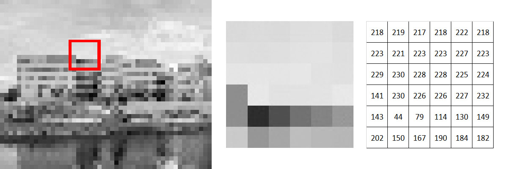
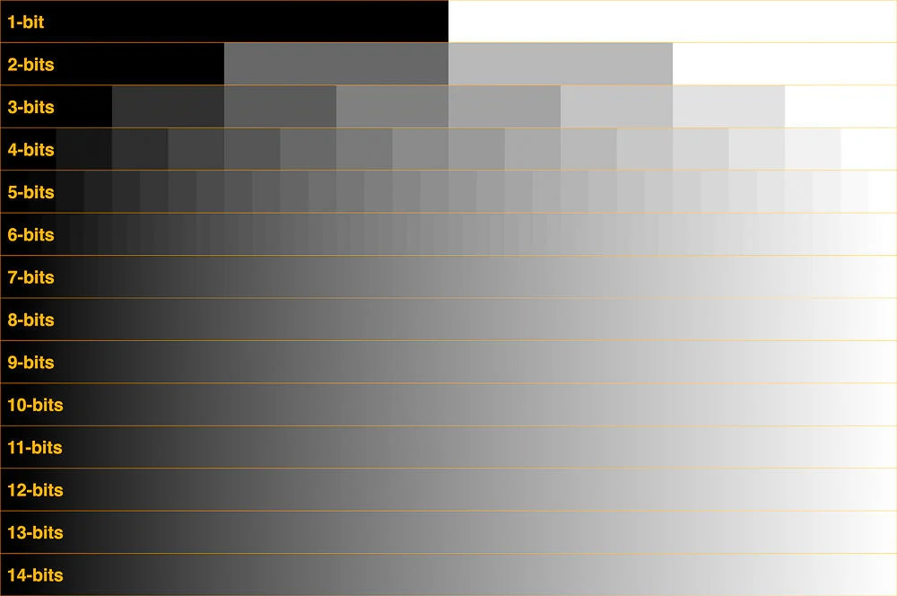
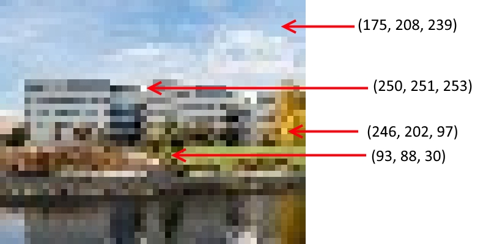

# Johdanto

## Mikä ihmeen OpenCV?

OpenCV on laaja-alainen konenäkökirjasto, joka perustuu Intelin vuonna 1999 aloittamaan avoimen lähdekoodin projektiin. OpenCV:tä ylläpidetään edelleen aktiivisesti, ja se on saavuttanut laajaa suosiota sekä yritysmaailmassa (mukaan lukien suuret nimet kuten Intel ja Google), korkeakouluissa että julkishallinnossa. [Opencv.orgin](https://opencv.org/about/) mukaan sillä on yli 47 tuhatta käyttäjää ympäri maailmaa, ja kirjastoa on ladattu yli 18 miljoonaa kertaa.

OpenCV:n opetuksellinen vahvuus piilee sen avoimuudessa. Kaikki kuvaoperaatioiden tulokset ovat näkyvillä, ja jokaisen parametrin vaikutusta voi kokeilla. Mikäli syvällinen ymmärrys menetelmistä kiinnostaa, käyttäjä voi tutustua itse [lähdekoodiin](https://github.com/opencv) (kirjoitettu C++:lla). Kuvaoperaatioiden tarkempi tunteminen on hyödyllistä, sillä kaupalliset kirjastot ja tuotteet, kuten älykamerat, hyödyntävät samoja menetelmiä. Syvällinen ymmärrys auttaa näin ollen myös kaupallisten tuotteiden tehokkaammassa käytössä. Mm. [TwinCAT Visionin](https://www.beckhoff.com/fi-fi/products/automation/twincat-vision/) syntaksi on miltei identtistä OpenCV:n kanssa ja funktiot on nimetty samoin, joten OpenCV on vähintäänkin inspiroinut tuotteen kehityksessä. 

Tämä kurssi pyrkii tarjoamaan osallistujalleen katsauksen OpenCV:n maailmaan ja esittelemään erilaisia esimerkkejä kirjaston eri toimenpiteiden käytöstä. Kurssin tarkoitus ei ole olla perusteellinen OpenCV-opas, vaan se rohkaisee opiskelijoita herättämään kiinnostusta konenäköön ja OpenCV:hen, kokeilemaan niitä omiin tarkoituksiinsa ja etsimään lisätietoa verkosta. Tämän johdanto-osan viimeisessä kappaleessa ohjeistetaan käyttämään OpenCV:n omaa dokumentaatiosivua.

Kurssilla käytetään Python-ohjelmointikieltä. OpenCV on saatavilla myös C++:lle (tehty sillä alunperin) ja JavaScriptille. Oletuksena on, että kurssin kävijä ymmärtää ohjelmoinnin perusteet ja hänellä on Python-tulkki asennettuna koneelleen. Tämän johdanto-osan toiseksi viimeisessä kappaleessa neuvotaan OpenCV-moduulin asennus.

## Kurssin rakenne

Kurssi sisältää seitsemän omaa aihettaan käsittelvää markdown-tiedostoa. Jokaiseen aihealueeseen liittyvät ja niissä läpikäydyt Python-ohjelmatiedostot löytyvät aihe-alueen mukaan nimetystä kansiosta. Kansio sisältää myös esimerkeissä käytetyt kuvat. Aiheiden lopuksi on tehtäviä, joiden avulla voi harjoitella aiheessa käsiteltyjä asioita. Näissä tehtävissä tarvittavat kuvat ovat niin ikään kyseisen aiheen kansiossa.

## Digitaalisten kuvien esitystapa

Konenäkömenetelmät perustuvat siihen, että digitaalinen kuva esitetään tietokoneen muistissa numeerisena taulukkona, jonka jokainen alkio viittaa kyseisen pikselin harmaasävyyn tai väriin. Esim. 8-bittinen 800 x 600 -kokoinen harmaasävykuva on taulukko, jossa on 800 saraketta ja 600 riviä ja jokainen taulukon alkio on kokonaisluku välillä 0 - 255 (8 bittiä tarkoittaa 28 = 256 eri arvoa). Luku 0 tarkoittaa mustaa ja 255 valkoista. Alla oleva kuva havainnollistaa tätä. Seuraava kuva taas havainnollistaa harmaasävyjen määrän eri bittisyvyyksillä 1 bitistä 14 bittiin.

*Alhaisen resoluution harmaasävykuva (jotta yksittäiset pikselit erottuvat), sen yksityiskohta ja yksityiskohdan pikselien harmaasävyarvot.*

*Eri harmaasävyarvojen määrä eri bittisyvyyksillä. [Kuvalähde](https://petapixel.com/2018/09/19/8-12-14-vs-16-bit-depth-what-do-you-really-need/). Ihmissilmä ei erota eroja 8 bitistä ylöspäin eivätkä kaikki näyttölaitteetkaan pysty niin monia sävyjä tuottamaan.*

Värikuvan tapauksessa jokainen pikseli eli taulukon alkio esittää kolme arvoa: pikselin värisävyn punaisen, sinisen ja vihreän komponentin. Punainen, sininen ja vihreä ovat ns. valon päävärit, joille ihmissilmän värisävyt aistivilla tappisoluillakin on omat herkkyysalueensa. Tämän takia digitaalisen kuvan väritkin tuotetaan näiden kolmen värin yhdistelmänä. LED-näytöt toimivat niin, että jokaista näytön pikseliä kohti on punainen, sininen ja vihreä ledi ja kyseisen pikselin värisävy saadaan säätämällä kunkin ledin kirkkautta. LCD-näytöissä taas on valkoinen tausta valo ja sen päällä kolmikerroksinen suodin, joissa yksi kerros suodattaa punaista, yksi vihreää ja yksi sinistä väriä. Tuotettu värisävy saadaan aikaan säätämällä suotimen kerrosten voimakkuutta kyseisen pikselin kohdalla.

Jos kyseessä on 24-bittinen värikuva eli varmasti yleisin värikuvamuoto, jokainen värisävy saa 8 siis bittiä (3 x 8 = 24) eli luvut 0...255. Tässä 0 tarkoittaa sitä, ettei sävyssä ole ollenkaan kyseistä väriä, ja 255, että kyseistä väriä on niin paljon kuin mahdollista. Esim. kirkkaan punainen väri on RGB-sävynä (255, 0, 0), kirkkaan sininen (0, 0, 255) ja kirkkaan sinipunainen (255, 0, 255). Musta taas on (0, 0, 0) ja valkoinen (255, 255, 255). Vaaleanvihreän eräs sävy on (0, 150, 0). Alla oleva kuva havainnollistaa värien esittämistä kuvassa näyttämällä muutamien pikselin RGB-arvot.

*Alhaisen resoluution värikuva ja muutaman pikselin RGB-arvot. Huomataan, että taivaan sävyssä on eniten sinistä ja rusahtavan oranssissa pääasiassa punaista ja vihreää (kirkkaan keltaisen värin RGB-arvo on (255, 255, 0)).*

OpenCV järjestää hiukan epäloogisesti värit aakkosjärjestykseen B-G-R. OpenCV:ssä siis esim. (255, 0, 0) on kirkkaan sininen eikä punainen.

Koska digitaaliset kuvat esitetään numeerisina taulukoina, myös kaikki digitaalinen kuvankäsittely ja myös konenäkö on matematiikkaa näillä luvuilla. Esim. harmaasävykuvassa vaaleaa taustaa vasten selkeästi havaittava tumma reuna näyttäytyy kuvataulukossa äkkinäisenä tiputuksena pikseliarvoissa (esim. 200 &rarr; 54) ja reuna voidaan automaattisesti löytää kuvasta etsimällä suuria eroja viereisten pikselien sävyissä.

## OpenCV:n asennus

OpenCV-moduuli asennetaan komennolla Pythonin pip-pakettienhallintajärjestelmää käyttämällä komennolla 

    pip install opencv-python

Mukana asentuu myös tehokkaaseen laskentaan käytettävä numeerisen Pythonin moduuli NumPy. NumPy on erityisen tehokas taulukko- ja matriisimuotoisen tiedon käsittelyssä, mikä sopii hyvin, sillä - kuten aiemmin käsiteltiin - digitaaliset kuvat ovat kokonaisluvuista koostuvia taulukoita. OpenCV avaa siis kuvat NumPy-taulukoina. 

## OpenCV:n dokumentaatio

Todella hyödyllinen apu on [OpenCV:n Python-dokumentaatiosivu](https://docs.opencv.org/4.x/d6/d00/tutorial_py_root.html). Tässä kurssissa käydään läpi lähinnä aiheita osioista [Core Operations](https://docs.opencv.org/4.x/d7/d16/tutorial_py_table_of_contents_core.html) ja [Image Processing in OpenCV](https://docs.opencv.org/4.x/d2/d96/tutorial_py_table_of_contents_imgproc.html). Dokumentaatiosivun vasemman yläkulman hakutoiminnon avulla voidaan hakea yksittäisen funktion dokumentaatio kirjoittamalla siihen funktion nimi. Jos tuloksia on useampi, oikea funktio on cv::funktion_nimi, esim. haettaessa nimellä `imread` oikea funktio on cv::imread. Muut tulokset johtavat joidenkin lisäosien toteutuksiin.

### Kurssin rakenne
**Johdanto | [Kuvien lukeminen](02-kuvien_lukeminen.md) | [Laskutoimitukset](03-laskutoimitukset.md) | [Harmaasävykuva](04-harmaasavykuva.md) | [Värit](05-varit.md) | [Esi- ja jälkikäsittely](06-esi_ja_jalkikasittely.md) | [Hough-muunnokset](07-hough.md)**