# Laskutoimitukset kuvilla

## Peruslaskutoimitukset

Koska kuvat ovat kokonaislukutaulukoita, niillä voi tehdä laskutoimituksia. Kuvan kaikkiin pikseliarvoihin voi siis esimerkiksi lisätä jonkin luvun, niistä voi vähentää jonkin luvun tai ne voi kertoa jollain luvulla. Tämän voi tehdä yksinkertaisesti seuraavalla tavalla:

    kuva = kuva + 10
    kuva = kuva - 25
    kuva = kuva * 2
    kuva = kuva / 2

Edellisissä esimerkeissä siis muuttujalle kuva tehdään jokin kokonaislukulaskutoimitus, ja sen jälkeen kuvan arvoksi asetetaan tämän laskutoimituksen tulos. Tämä lähestymistavan ongelma on, että kuvan pikseliarvojen lukutyyppi on 8-bittinen positiivinen kokonaisluku eli pikselit (tai niiden värikomponentit) voivat saada arvoja 0...255. Jos lähes valkoiseen pikseliin (esim. arvo 253) lisätään 10, tulokseksi pitäisi tulla 263, mutta koska se ei ole lukualueella, tapahtuu ylivuoto ja arvoksi tulee 7. 255:n jälkeen siis aloitetaan uudestaan 0:sta. Sama tapahtuu, jos miltei mustasta vähennetään pikseliarvoa suurempi luku: tällöin vain jatketaan vähentämistä luvusta 255. Niinpä esim. 12 - 25 = 242. Seuraavat kuvat havainnollistaa tätä. Molempiin lisätään 30. Harmaasävykuvassa alkuperäisen kuvan vaaleimmat kohdat muuttuvat tuloskuvissa miltei mustaksi. Värikuvassa taas lähellä valkoista olevat sävyt muuttuvat miltei mustiksi ja kirkkaat sävyt muuttuvat erivärisiksi. Esimerkiksi alemmassa kuvassa punainen mainostaulu on muuttunut turkoosiksi. Alkuperäisessä kuvassa mainostaulun alueen pikselien punaisen arvo on noin 240, joten tuloskuvassa se on noin 20. Vihreän ja sinisen arvo taas on alkuperäisessä kuvassa noin 100 ja tuloskuvassa noin 130. Niinpä punertava sävy on muuttunut turkoosiksi sävyksi ((100, 100, 240) &rarr; (130, 130, 20)).

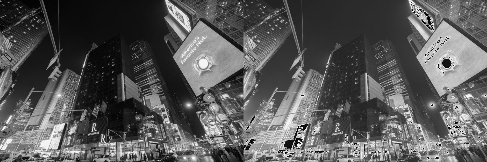
*Esimerkki ylivuodosta harmaasävykuvalla. Oikeanpuoleinen kuva on vasemmanpuoleinen + 30.*

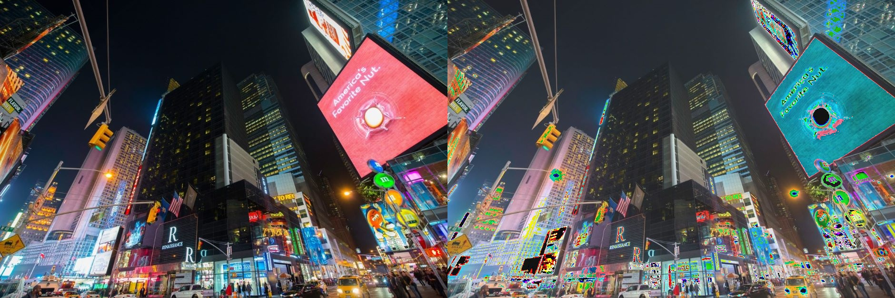
*Esimerkki ylivuodosta värikuvalla. Oikeanpuoleinen kuva on vasemmanpuoleinen + 30.*

Ylivuoden estämiseksi kuva täytyy ensin muuttaa toiseen lukutyyppiin, joka sallii myös negatiiviset luvut ja lukua 255 suuremmat luvut (esim. int16), laskutoimitus tehdään sitten ja lopuksi kuva täytyy muuttaa takaisin uint8-muotoon. Vaivattomimmin laskutoimitukset kuitenkin onnistuvat käyttämällä OpenCV:n valmiita funktiota, jotka ottavat ylivuoden mahdollisuuden huomioon.

    kuva = cv2.add(kuva, 10)
    kuva = cv2.subtract(kuva, 25)
    kuva = cv2.multiply(kuva, 2)
    kuva = cv2.divide(kuva, 2)

Alla esimerkkinä 30:n lisääminen samoihin esimerkkikuviin käyttämällä `add`-komentoa. Nyt ylivuotoa ei tule. Kokonaisluvun lisääminen kuvaan siis vaalentaa kuvaa, sillä pikselien arvot lähenevät valkoisen arvoa 255 (harmaasävykuvat) tai (255, 255, 255) (värikuvat). Samoin tekee luonnollisesti kertolasku, joskin radikaalimmin. Vastaavasti vähennyslasku tai jakolasku tummentaa kuvaa, koska tällöin pikselien arvot lähenevät nollaa eli mustaa.

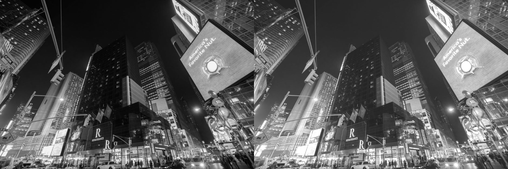
*Esimerkki onnistuneesta yhteenlaskusta harmaasävykuvalla. Oikeanpuoleinen kuva on vasemmanpuoleinen + 30.*

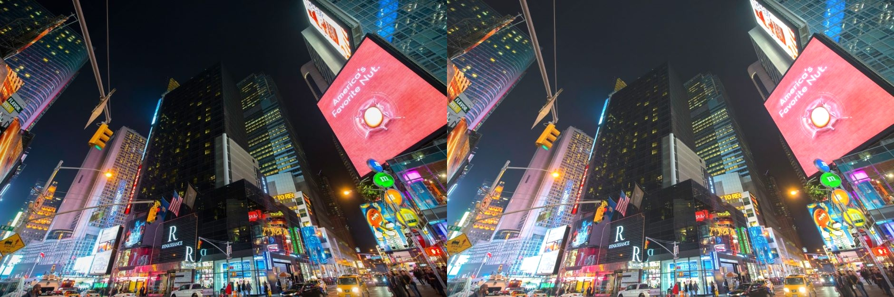
*Esimerkki onnistuneesta yhteenlaskusta värikuvalla. Oikeanpuoleinen kuva on vasemmanpuoleinen + 30.*

Samalla tavalla kuvia voi laskea yhteen tai kuvia voi vähentää toisistaan (tai kertoa tai jakaa), jos ne ovat samankokoisia eli niissä on yhtä monta riviä ja saraketta ja tasoa (eli molemmat kuvat ovat joko harmaasävykuvia tai värikuvia). Tällöin laskutoimitukset suoritetaan kuvien vastinpikseleillä.

    kuva3 = kuva1 + kuva2
    kuva3 = kuva1 - kuva2

    TAI (ylivuotojen välttämiseksi)

    kuva3 = cv.add(kuva1, kuva2)
    kuva3 = cv2.subtract(kuva1, kuva2)

Kuviin voidaan näin helposti lisätä jokin valkoinen logo tms. Tulos on selkein, kun lisättävän kuvan tausta on mahdollisimman tumma. Lisättäessä kuvaan harmaasävy- tai värikuva, jossa ei ole pelkkää valkoista, päällekkäisten alueiden sävyt muuttuvat aluiden summiksi. Alla esimerkki valkoisen logon lisäämisestä harmaasävykuvaan ja satelliitin lisäämisestä värikuvaan käyttämällä komentoa `add`.

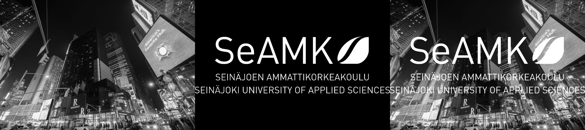
*Esimerkki harmaasävykuvien yhteenlaskusta. Oikeanpuoleinen kuva on vasemmanpuoleisen ja keskimmäisen summa.*

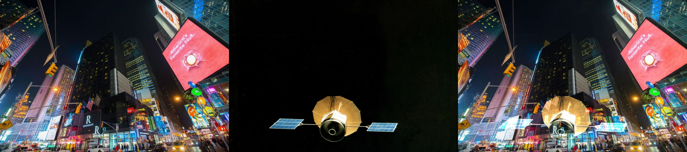
*Esimerkki värikuvien yhteenlaskusta. Oikeanpuoleinen kuva on vasemmanpuoleisen ja keskimmäisen summa.*

### Taustan poisto erotuksella

Kahden kuvan erotuskuvassa näkyy tummaa taustaa vasten ne osa-alueet, jotka eroavat toisistaan kuvissa. Keskenään samanlaisten alueiden pikselien arvot ovat liki samat, ja niiden erotukseksi siis tulee liki nolla. Havainnollistetaan tätä seuraavalla kuvaparilla, joka esittää samaa huonetta tyhjänä ja siten, että siellä on joku vierailija.

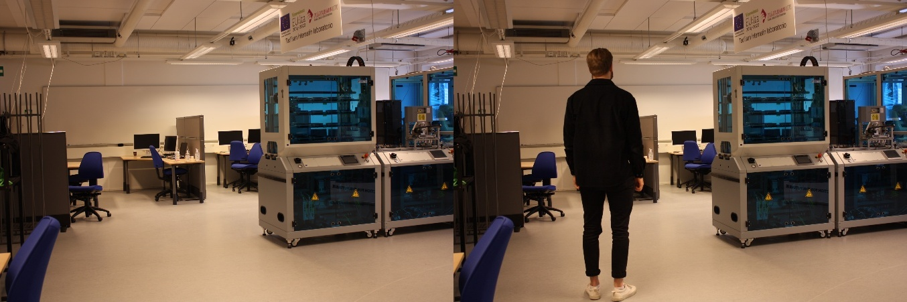
*Kuva tyhjästä huoneesta ja kuva samasta huoneesta, jossa on joku.*

Kun kuva tyhjästä huoneesta vähennetään komennolla `subtract` kuvasta, jossa huoneessa on vierailija, jää jäljelle vain vierailijan hahmo. Koska tässä esimerkissä vierailijalla on tummat vaatteet, ei hahmoa juuri tuloskuvasta erota. Tämä nähdään alapuolisen kuvaparin vasemmassa kuvassa. Tämän takia parempi tapa on laskea erotuksen itseisarvo komennolla `absdiff`seuraavasti 

        kuva3 = cv2.absDiff(kuva2, kuva1)

Tällöin nähdään kuvien absoluuttinen ero, joka ei ota kantaa värivalintoihin. Nyt vierailijan hahmo näkyy erotuskuvassa selvästi kuten alemman kuvaparin oikeanpuoleinen kuva näyttää.

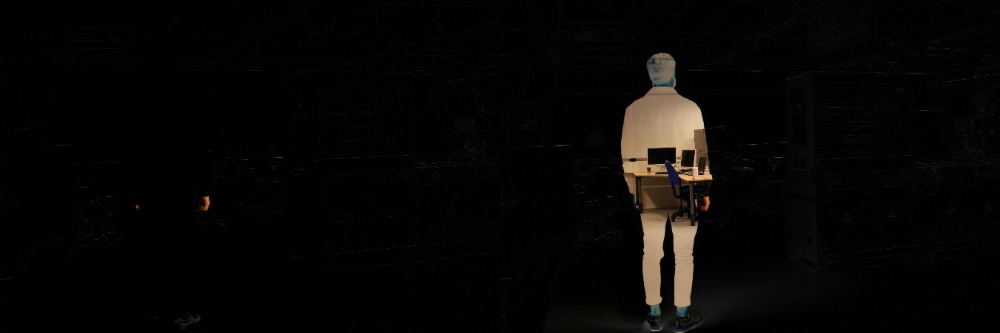
*Funktioiden subtract ja absDiff tulosten. Vasemmanpuoleinen kuva on saatu subtractilla ja oikeanpuoleinen absDiffilla.*

### Taustan poisto erillisiä luokkia käyttämällä

Taustan poistamiseen on OpenCV:ssä kaksi omaa luokkaa, joilla ensin luodaan taustan poistamiseen käytettävä olio samoin kuin videon lukemisessa luotiin lukemiseen käytettävä olio. Sitten tausta poistetaan kuvasta käyttämällä luodun olion metodia. Luokat ovat `createBackgroundSubtractorMOG2` ja `createBackgroundSubtractorKNN`. Ne toteuttavat taustan poiston hieman eri tavalla. Niitä voi käyttää kuvasarjoihin tai videoihin. Oheinen koodinpätkä näyttää taustanpoistajan toiminnan esimerkkivideolta. Ensin taustanpoistaja luodaan (eri versioita voi kokeilla vaihtamalla kommentin paikkaa rivin alussa), sitten video avataan ja sitten jokaiselle ruudulle käytetään taustanpoistajaa. Lopuksi näytetään alkuperäisen videon ruutu ja sama ruutu siten, että tausta on musta ja etuala valkoinen. Tällaisen maskia voidaan käyttää edelleen kuvan maskaamiseen niin, että tausta poistuu. Tästä enemmän binäärilaskutoimituksia käsittelevässä kappaleessa hieman alempana.

    import cv2
    
    taustanPoistaja = cv2.createBackgroundSubtractorMOG2()
    #taustanPoistaja = cv2.createBackgroundSubtractorKNN()
    
    cap = cv2.VideoCapture("laskutoimitukset/vtest.avi")

    while True:
        ret, frame = cap.read()
        if frame is None:
            break

        maski = taustanPoistaja.apply(frame)

        cv2.imshow("ruutu", frame)
        cv2.imshow("maski", maski)

        # Toisto lopetetaan, kun näppäintä q painetaan
        if cv2.waitKey(30) & 0xFF == ord('q'): 
            break

Seuraavat kuvat esittävät taustanpoistajan tulokset yhdelle ruudulle videosta. Kuten nähdään, KNN-menetelmään perustuva taustanpoistaja vaikuttaa toimivan tarkemmin ainakin tämän videon tapauksessa.

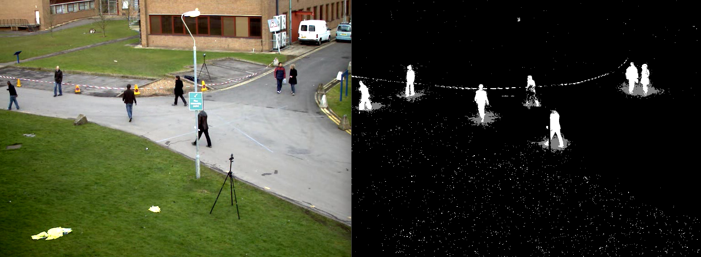
*Esimerkki taustan poistosta käyttämällä MOG2:een perustuvaa taustanpoistajaa.*

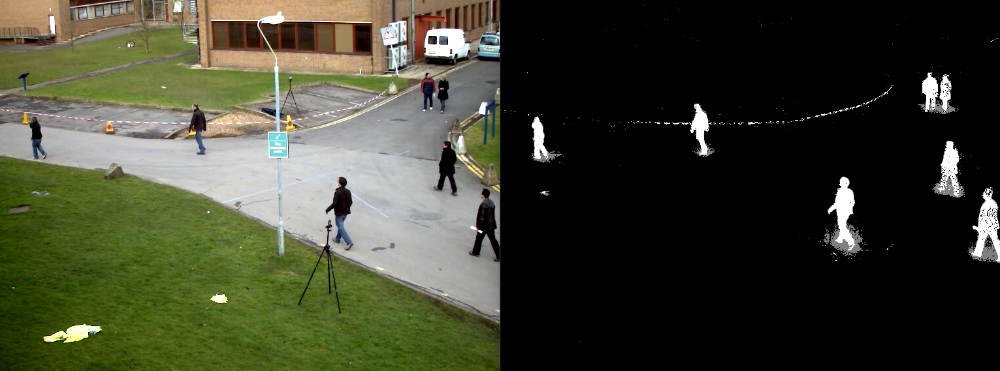
*Esimerkki taustan poistosta käyttämällä KNN:ään perustuvaa taustanpoistajaa.*

Jos yksittäinen kuva videossa näkyvässä taustasta on saatavilla, taustan poisto onnistuu myös `subtractin`tai `absDiffin` avulla. OpenCV:n taustanpoistajat kuitenkin päivittävät taustamalliaan, joka kuvalla, jolloin voidaan reagoida vaikka pieneen kameran liikkeeseen tai pieniin valaisuuden muutoksiin.

## Häivyttäminen eli painoa käyttävät laskutoimitukset

Kuva voidaan lisätä toiseen kuvaan myös häivytettynä eli vaikka painokertoimella 0,3. Tällöin se näkyy haaleampana toisen kuvan päällä. Tällöin voidaan käyttää funktiota `scaleAdd`. Silloin komento on seuraavanlainen:

    summa_skaala = cv2.scaleAdd(kuva2, 0.5, kuva1)

Nyt kuva2 lisätään painokertoimella 0,5 kuvaan kuva1. Jos molempiin kuviin haluaa käyttää painokerrointa, oikea komento on siinä tapauksessa `addWeighted`. Sitä käytetään seuraavasti

    summa_painot = cv2.addWeighted(kuva1, 0.5, kuva2, 0.5, 0)

Nyt molempien kuvien paino on 0,5. Viimeinen parametri, jonka arvo on yllä olevassa funktiokutsussa nolla, on summaan lisättävä vakio. Molempien laskutoimitusten tulokset näytetään alla olevassa kuvassa.

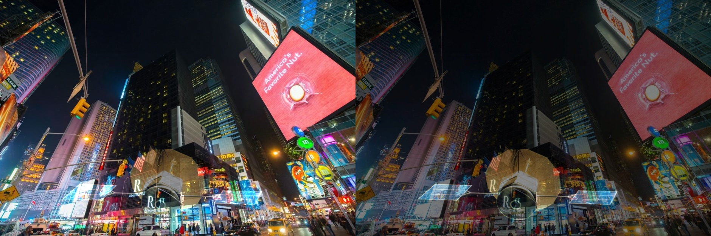
*Funktion scaleAdd tulos vasemmalla ja addWeighed oikealla.*

Jos halutaan, että lisättävän kuvan ja alkuperäisen kuvan päällekkäisten alueiden pikseliarvot eivät sekoitu (jos siis lisättävän kuvan tausta on hyvin tumma), voidaan osa alkuperäisen kuvan pikseleistä korvata lisättävän kuvan pikseleillä. Käyttämiemme esimerkkikuvien tapauksessa sopiva komento voisi olla esimerkiksi

    kuva1[kuva2 > 30] = kuva2[kuva2 > 30]    

Nyt ne kuvan 1 pikselit, jotka sijaitsevat alueella, jolla kuvan 2 pikselien arvo (mikä tahansa väri) ylittää arvon 30, korvataan kyseisillä kuvan 2 pikseleillä. Kuvan 2 tausta on aika tumma, joten sen pikselien arvo on alle 30. Näin saadaan pelkkä satelliitti lisättyä kuvaan 1. Osa satelliitinkin pikseleistä on sen verran tummia, että sen etuosaan jää reikiä.

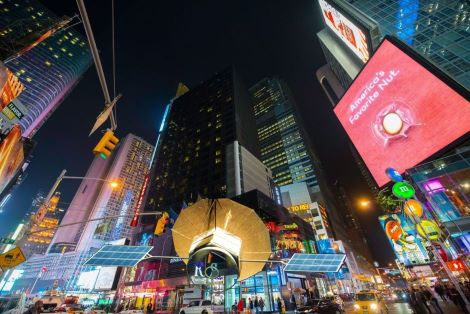\
*Alkuperäisen kuvan pikselit korvattuna toisen kuvan pikseleillä.*

## Binäärilaskutoimitukset

Mustavalkoisten kuvien kanssa voidaan käyttää binäärilaskutoimituksia. Kuvan pikseliarvot voidaan kääntää (musta valkoiseksi ja valkoinen mustaksi) negaation toteuttavalla funktiolla `bitwise_not`. Kahdelle binäärikuvalle voi tehdä loogisen tai-operaation funktiolla `bitwise_or`. Tällöin siis tuloskuvassa valkoisia ovat pikselit, jotka ovat valkoisia jommassakummassa alkuperäisessä kuvassa, ja mustia pikselit, jotka ovat mustia kummassakin alkuperäisessä kuvassa. Itse asiassa sama tulos saataisiin aiemmin esitellyllä komennolla `add` Alla esitellään kuva ja sen negaatio sekä kaksi binäärikuvaa ja niiden tai-operaation tulos. Tarvittavat komennot ovat siis

    kuva_neg = cv2.bitwise_not(kuva1)
    kuva_or = cv2.bitwise_or(kuva1, kuva2)

\
*Mustavalkoinen kuva ja sen bitwise_not-komennolla tuotettu negaatio.*

\
*Kaksi mustavalkoista kuvaa ja bitwise_or-komennolla tuotettu niiden yhdistelmä.*

Kaikista hyödyllisin binäärioperaatio on `bitwise_and`. Sen avulla kuvaa voidaan maskata mustavalkokuvalla eli kaikki kuvan alueet, jotka ovat mustia maskissa, muutetaan mustaksi. Havainnollistetaan tätä videon taustanpoistoa käsittelevän kappaleen materiaalilla. Koska maskikuva on tyypiltään harmaasävykuva ja videon ruutu on värikuva, komento täytyy kirjoittaa.

    maskattu = cv2.bitwise_and(frame, frame, mask=maski)

Nyt itse asiassa and-operaatio tehdään kahdelle samalla kuvalle ja tulosta vain maskataan maskilla. Toinen vaihtoehto olisi muuttaa käytettävä maskikuva tyypiltään värikuvaksi ja kirjoittaa komento sitten yksinkertaisesti

    maskattu = cv2.bitwise_and(frame, maski)

Kuvatyypeistä ja värimuunnoksista lisää värikuvia käsittelevässä oppitunnissa. Tulos näyttää kuitenkin tältä:

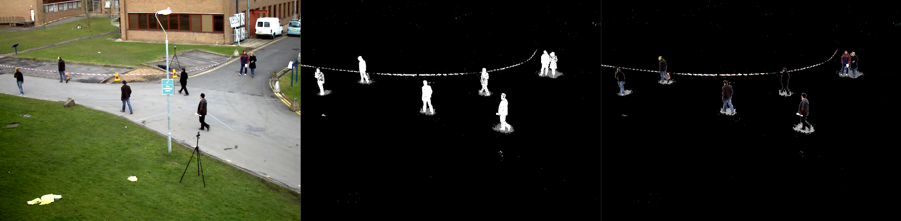\
*Videon ruutu, taustan poistava maski ja bitwise_and-operaatiolla maskattu ruutu.*

## Kuvan kaikkien pikselien summa tai keskiarvo

Kuvan kaikkien pikselien summan ja keskiarvon saa NumPyn komennoilla

    summa = np.sum(kuva)
    keskiarvo = np.mean(kuva)

Nämä ovat käytännöllisiä, kun halutaan esim. tarkastella kuvien vaaleuseroja. Vaaleamman kuvan pikselien summa on suurempi kuin tummemman kuvan. Myös poistettaessa kuvasta tausta sen pikselien summa tai keskiarvo on huomattavasti pienempi etualan ollessa tyhjänä verrattuna tilanteeseen, jossa etualalla on jotain. Jos siis otetaan ensin erotus kahdesta kuvasta, jotka esittävät samaa huonetta tyhjänä, ja lasketaan saadun erotuskuvan summa, se on paljon pienempi kuin laskettaessa pikselien summa erotuskuvasta, joka ollaan saatu aikaan tyhjää ja ei-tyhjää huonetta esittävistä kuvista. Näin saadaan aikaan helppo liiketunnistin.

Koska taustassa saattaa olla helposti pientä heittoa kuvien välillä valojen värinän, kameran tärähtelyn tai vain kohinan takia, voidaan summa (tai keskiarvo) laskea vain tietyn arvon ylittävistä pikseleistä samaan tapaan kuin edellisen kappaleen esimerkissä kuvan tiettyjen pikselien korvaamisesta toisen kuvan pikseleillä.

    summa = np.sum(kuva[kuva > 30])
    keskiarvo = np.mean(kuva[kuva > 30])

## Kuvan koon muuttaminen

Tämä ei ole suoraan kuvilla tehtävä laskutoimitus, mutta kuvan koon muuttaminen on usein laskutoimituksien kannalta tärkeää, sillä kuvien täytyy olla samankokoisia. Koon muuttamiseen on komento `resize`, jolle annetaan parametreiksi joko uuden kuvan koko tai uuden leveyden ja korkeuden kerroin verrattuna alkuperäisiin. Komento siis näyttää jommaltakummalta: 

    uusi_kuva = cv2.resize(kuva, (800, 600))
    uusi_kuva = cv2.resize(kuva, None, fx=0.75, fy=0.75)

Ensimmäisessä uuden kuvan kooksi asetettiin 800 x 600 pikseliä, toisessa taas sekä leveys (fx) että korkeus (fy) muutettiin 75 %:iin alkuperäisistä arvoista.

Kuvan koon taas saa selville komennolla
    
    rivit, sarakkeet = kuva.shape[:2]

`Shape`-metodin palautusarvo nimittäin on harmaasävykuvien tapauksessa (rivit, sarakkeet) ja värikuvien tapauksessa (rivit, sarakkeet, kanavat). Edellinen komento toimii kummillakin kuvamuodoilla.

Niin kutsutuissa kuvapyramideissa kuvan korkeutta ja leveyttä tiputetaan aina puoleen verrattuna alkuperäiseen pienentäessä kuvaa tai korkeus ja leveys kaksinkertaistetaan suurennettaessa kuvaa. Saadut kuvat ovat tavallaan pyramidin poikkileikkauksia eri korkeuksilta. Tähän käytettävät komennot ovat `pyrDown` ja `pyrUp`. Seuraavassa esimerkissä kuvaa pienennetään funktiolla `pyrDown` viidesti peräkkäin for-silmukassa ja jokainen pienennys näytetään omassa ikkunassaan. Tuloskuvat näytetään koodinpätkän alla.

    cv2.imshow("alkuperainen", kuva)
    for kierros in range(5):
        kuva = cv2.pyrDown(kuva)
        cv2.imshow(f"kierros {kierros + 1}", kuva)

    cv2.waitKey(0)

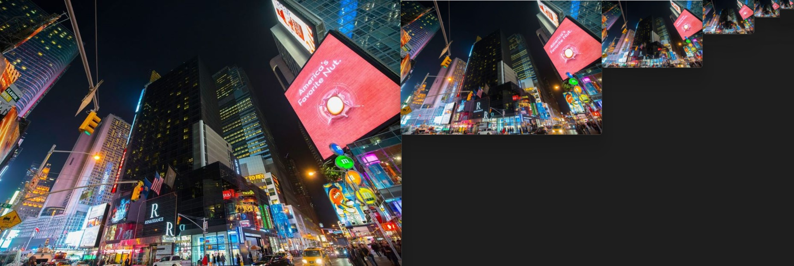\
*Esimerkki kuvapyramideistä: alkuperäinen kuva ja viisi kierrosta pienennystä. Joka kierroksella kuva pienenee neljäsosaan edellisestä.*

Itse asiassa haluttaessa pienentää kuvan mitat 1/2:een, 1/3:aan, 1/4:aan jne. alkuperäisestä, se voidaan tehdä myös lukemalla kuvasta vain joka toinen rivi ja sarake, joka kolmas rivi ja sarake, joka neljäs rivi ja sarake jne. seuraavasti. Alla oleva kuva näyttää näiden komentojen tulokset rinnakkain.

    kuva_neljannes = kuva[::2, ::2]
    kuva_yhdeksasosa = kuva[::3, ::3]
    kuva_16osa = kuva[::4, ::4]
    kuva_25osa = kuva[::5, ::5]

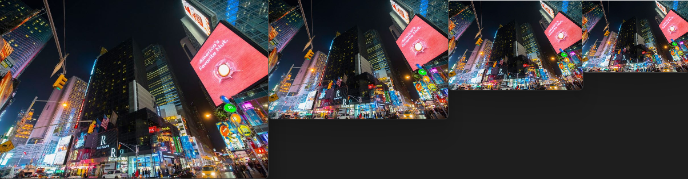\
*Esimerkki kuvan pienennyksistä lukemalla vain osa riveistä ja sarakkeista.*

### Kurssin rakenne
**[Johdanto](01-johdanto.md) | [Kuvien lukeminen](02-kuvien_lukeminen.md) | Laskutoimitukset | [Harmaasävykuva](04-harmaasavykuva.md) | [Värit](05-varit.md) | [Esi- ja jälkikäsittely](06-esi_ja_jalkikasittely.md) | [Hough-muunnokset](07-hough.md)**

## Tehtäviä

1. Etsi kaksi mitä tahansa kuvaa netistä, muuta ne samankokoisiksi hyödyntämällä metodia `shape` ja funktiota `reshape` ja summaa ne toisiinsa käyttämällä funkitoita `add`, `scaleAdd` ja `addWeighted`.
2. Kokeile taustanpoistoa webkameran kanssa kahdella tavalla. 1) ottamalla ensin sillä yksittäisen kuvan taustasta, tallettamalla sen ja vähentämällä sen sen jälkeen kaikista webkameralla otettavista kuvista 2) hyödyntämällä taustanpoistajia `createBackgroundSubtractorMOG` ja `createBackgroundSubtractorKNN`.
3. Toteuta `add`- ja `subtract`-funktioiden toiminta manuaalisesti eli 1) muuta kuva laajempaan lukualueeseen 2) suorita laskutoimitus 3) muuta uint8-lukualueen ylittävät arvot 255:een ja/tai alittavat arvot 0:aan 4) muuta kuva takaisin uint8-lukualueelle.
