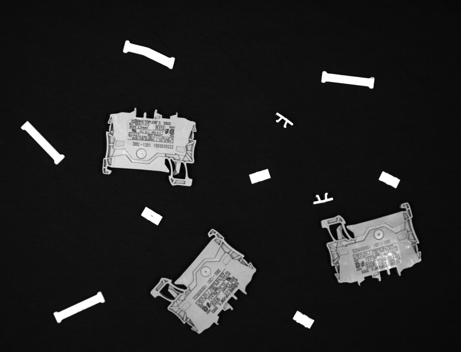
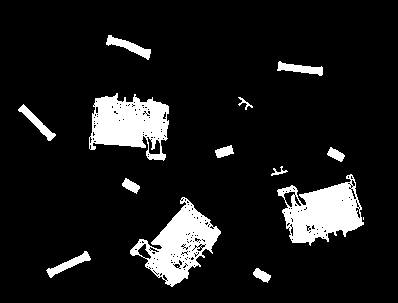
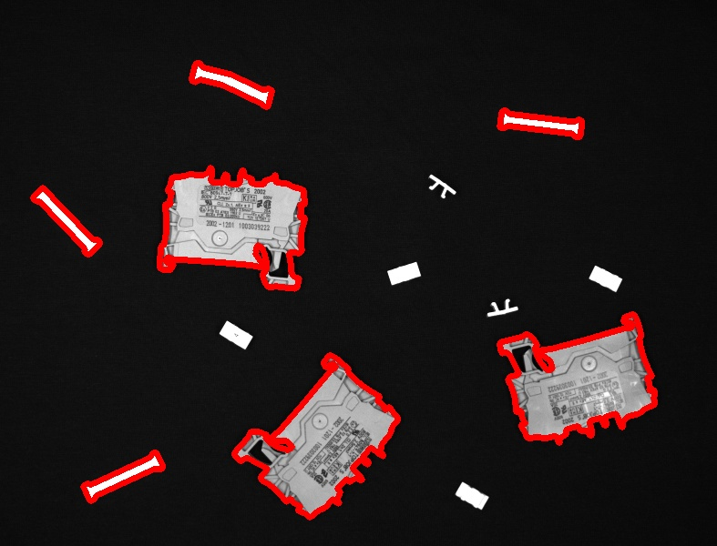
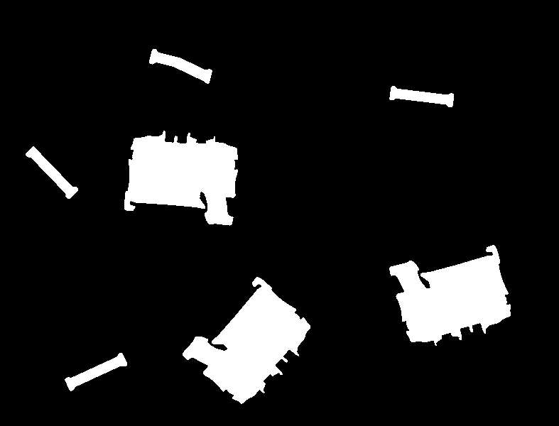

# Kohteiden analysointi harmaasävykuvissa
## Segmentointi
Jotta kuvassa näkyviä kohteita voidaan analysoida eli niille voidaan suorittaa mittauksia tai niitä voidaan lajitella niiden muodon perusteella, kohteet täytyy jotenkin saada paikannettua kuvasta. Segmentoinnissa kuva jaetaan taustaan ja mielenkiintoisiin osioihin myöhempää analyysia varten. Segmentointia varten kuva yleensä ensin binärisoidaan eli siitä tehdään täysin mustavalkoinen. Tyypillisesti musta väri esittää taustaa, ja valkoinen väri esittää mielenkiintoisia alueita eli ns. etualaa. 

### Kynnystäminen
Kynnystäminen on yksinkertaisin kuvien binärisointitapa. Yksinkertaisin kynnystämistapa puolestaan on globaali kynnystys. Siinä valitaan yksi kynnysarvo, ja tuloskuvassa kaikki alkuperäisen kuvan pikselit, joiden arvo on yhtä suuri tai suurempi kuin kynnysarvo, esitetään valkoisina, ja kaikki alkuperäisen kuvan pikselit, joiden arvo on pienempi kuin kynnysarvo, esitetään mustina. Jotta kynnystäminen tuottaisi hyvän mustavalkokuvan, täytyy alkuperäisessä kuvassa olla hyvä kontrasti. Tämä pyritään varmistamaan konenäkösovelluksissa käyttämällä hyvää valaistusta. 

Käytetään esimerkkinä kuvaa muovisista komponenteista. Ladataan se muuttujaan `kuva` värikuvana ja muunnetaan se harmaasävykuvaksi, joka sijoitetaan muuttujaan `kuva_hs`. Kuva esitellään koodinpätkän jälkeen.

    kuva = cv2.imread("komponentit.png")
    kuva_hs = cv2.cvtColor(kuva, cv2.COLOR_BGR2GRAY)

*Muovisia komponentteja esittävä kuva.*

Kuvan kynnystämiseen on OpenCV:ssä funktio `threshold`. Sille annetaan parametrina harmaasävykuva, käytettävä kynnysarvo, tuloskuvassa olevien kynnysarvon ylittävien pikselien arvo (yleensä 255 eli valkoinen) ja kynnystystapa. Funktio käytetyn palauttaa kynnysarvon sekä kynnystetyn tuloskuvan. Seuraava komento siis kynnystää kuvan `kuva_hs` käyttäen kynnysarvoa 100. Tuloskuva koodinpätkän alla.

    kynnys, kuva_mv = cv2.threshold(kuva_hs, 100, 255, cv2.THRESH_BINARY)

*Kynnystetty mustavalkokuva.*

Halutussa lopputuloksessa mielenkiinnon kohteet on esitetty valkoisella. Jos alkuperäinen kuva esittää tummia kohteita vaalealla taustalla, kynnystystulos invertoidaan eli musta muutetaan valkoiseksi ja toisinpäin. Tämä saadaan aikaiseksi käyttämällä funktion `threshold` viimeisenä parametrina arvoa `cv2.THRESH_BINARY_INV` arvon `cv2.THRESH_BINARY` sijaan. 

Kannattaa kokeilla edellistä kynnystystä käyttämällä eri kynnysarvoja. Erot lopputuloksessa ovat selviä.

Kynnystämiseen on olemassa myös automaattinen menetelmä, jota kehittäjänsä mukaan kutsutaan Otsun menetelmäksi. Tällöin kynnysarvo valitaan automaattisesti siten, että pikseliarvojen vaihtelu alkuperäisessä kuvassa olisi mahdollisimman pientä tuloskuvan samaksi väriksi (mustaksi tai valkoiseksi) tulkittavassa alueessa. Otsun menetelmää käytetään `threshold`-funktiossa asettamalla viimeinen parameteri arvoon `cv2.THRESH_OTSU` tai `cv2.THRESH_OTSU + cv2.THRESH_BINARY_INV` sen mukaan, halutaanko lopputulos invertoida vai eli:

    kynnys, kuva_mv = cv2.threshold(kuva_hs, 100, 255, cv2.THRESH_OTSU)
    
    TAI
    
    kynnys, kuva_mv = cv2.threshold(kuva_hs, 100, 255, cv2.THRESH_OTSU + cv2.THRESH_BINARY_INV)

Tällöin ei ole väliä, mitä lukua käyttäjä käyttää funktiokutsussa toisena parametrina, sillä kynnysarvo valitaan automaattisesti. Otsun menetelmää käytettäessä ymmärtää myös, miksi funktio `threshold` palauttaa mustavalkokuvan lisäksi käytetyn kynnyksen.

Kannattaa kokeilla myös Otsun automaattista kynnystystä tämän osion testikuvalle.

## Ääriviivat

Täysin mustavalkoisesta kuvasta voidaan etsiä valkoisten muotojen ääriviivat komennolla `findContours`. Ääriviivojen perusteella taas voidaan suorittaa muodoille erilaisia mittauksia, kuten laskea niiden pinta-alan, lävistäjän tai ympärysmitan, sovittaa niiden ympärille erilaisia muotoja kuten suorakulmoita tai ympyröitä tai sovittaa ääriviivojen pisteisiin erilaisia muotoja kuten ellipsin tai viivan. Funktiota `findContours` kutsutaan seuraavasti:

    reunaviivat, hierarkia = cv2.findContours(kuva_mv, cv2.RETR_EXTERNAL, cv2.CHAIN_APPROX_SIMPLE)

Paluuarvoista `reunaviivat` on tuple eli eräänlainen lista x&ndash;y-koordinaatteja sisältäviä kaksiulotteisia Numpy-taulukoita. Jokainen taulukko sisältää yksittäisen muodon ääriviivan koordinaatit. Ääriviiva-tuple voi siis näyttää vaikka tältä:

    (array([[[489, 210]],
    [[489, 209]],
    [[490, 208]],
    [[231, 184]]], dtype=int32), 
    
    array([[[[636, 149]],
    [[637, 148]],
    [[637, 142]],
    [[638, 132]]], dtype=int32), 
    
    array([[[[284,  96]],
    [[256,  83]],
    [[255,  82]],
    [[254,  82]],
    [[253,  81]],
    [[250,  81]]], dtype=int32))

Tässä mustavalkokuvassa on kolme valkoista muotoa, sillä tuple sisältää kolme kaksiulotteista taulukkoa. Jokainen Numpy-taulukko alkaa sanalla `array`, ja sen jälkeen hakasulkeissa on x&ndash;y-koordinaattipareja. Jokainen x-koordinaatti kertoo sarakkeen, jolla kyseinen ääriviivan piste sijaitsee ja y-koordinaatti rivin. Lopussa kerrotaan, että Numpy-taulukon lukujen tyyppi on 32-bittiset kokonaisluvut, siis luvut, jotka saavat arvoja -231:stä 231:een eli noin -2,1 miljoonasta +2,1 miljoonaan. Lukualuetta siis piisaa vähän isommillekin kuville!

Palautusarvo `hierarkia`sisältäisi taulukon ääriviivojen välisestä hierarkiasta, jos `findContours`-funktion parametreissa määriteltäsiin, että oltaisiin kiinnostuneita myös sisäkkäisistä ääriviivoista. Hierarkiataulukko kertoo jokaiselle ääriviivalle niin sanotun vanhemman, eli ääriviivan, minkä sisällä tämä ääriviiva on, ja lapsen, eli ääriviivan, joka on tämän ääriviivan sisällä. Jos ääriviivalla ei ole "vanhempaa" tai "lasta", sen tilalla on arvo -1. Tarkempaa tietoa ääriviivojen hierarkiasta voi lukea [OpenCV:n dokumentaatiosivulta](https://docs.opencv.org/4.x/d9/d8b/tutorial_py_contours_hierarchy.html).

Ääriviivoja voi askeltaa for-silmukassa ja niiden eri ominaisuuksien selvittämiseen on valmiita funktioita. Esim. komento `contourArea` laskee ääriviivan rajaaman alueen pinta-alan, `arcLength` sen ympärysmitan, `boundingRect` sen ympärille piirrettävän suorakulmion, `minAreaRect`sen ympärille piirrettävän pienimmän mahdollisen suorakulmion, `fitEllipse`sovittaa ääriviivan pisteisiin ellipsin ja `fitLine`sovittaa viivan. Ääriviivan ympärille sovitettavien suorakulmioiden ja ympyröiden avulla voi sitten laskea ominaisuuksia kuten muotosuhteen tai täyttösuhteen. Kaikki ääriviivojen perusteella laskettavat asiat esitellään esimerkkien kera [tällä](https://docs.opencv.org/4.x/dd/d49/tutorial_py_contour_features.html), [tällä](https://docs.opencv.org/4.x/d1/d32/tutorial_py_contour_properties.html) ja [tällä](https://docs.opencv.org/4.x/d5/d45/tutorial_py_contours_more_functions.html) sivulla.

Ääriviivat voi piirtää komennolla `drawContours`. Tämä funktio olettaa saavansa parametrinaan listan ääriivoista, joten yksittäisen ääriviivan tapauksessa tämä ääriviiva pitää laittaa hakasulkeisiin (jolloin muodostetaan lista, jossa on vain tämä yksi ääriviiva). Seuraava koodinpätkä käy läpi kaikki löydetyt ääriviivat, laskee niiden rajaaman pinta-alan ja piirtää alkuperäiseen BGR-kuvaan punaisella ääriviivat, joiden rajaama pinta-ala on suurempi kuin 1000 pikseliä.

        for reunaviiva in reunaviivat:
            if cv2.contourArea(reunaviiva) > 1000:
                cv2.drawContours(kuva, [reunaviiva], -1, (0, 0, 255), 5)

Funktiolle `drawContours` annetaan siis ensimmäiseksi parametriksi kuva, johon ääriviivat piirretään, toiseksi parametriksi ääriviivalista, josta ääriviiva(t) piirretään, kolmanneksi parametriksi piirrettävän ääriviivan indeksi (-1 tarkoittaa kaikkia listan sisältämiä ääriviivoja), neljänneksi parametriksi piirtoväri BGR:nä ja viidenneksi parametriksi piirtoviivan paksuus pikseleinä.

   
*Suurten komponenttien ääriviivat korostettuna kuvassa.*

Funktiolla `drawContours` voidaan myös piirtää ääriviivan esittämät muodot yhdellä värillä. Tällöin viivanpaksuudeksi asetetaan -1. Funktiota voi käyttää esim. piirtämään vain tietyt muodot uuteen mustavalkokuvaan. Seuraava koodinpätkä on edellinen hieman muokattuna, ja se luo uuden kokomustan kuvan ja piirtää siihen pinta-alaltaan yli 1000 pikselin suuruiset objektit valkoisina. Tuloskuva on siis kuten kynnystetty binäärikuva, mutta siitä puuttuvat pienimmät muodot.

    tuloskuva = np.zeros_like(kuva_mv)
    for reunaviiva in reunaviivat:
        if cv2.contourArea(reunaviiva) > 1000:
            cv2.drawContours(tuloskuva, [reunaviiva], -1, 255, -1)

NumPyn funktio `zeros_like` luo pelkästään nollia sisältävän taulukon, joka on samankokoinen ja lukutyypiltään sama kuin sille parametrina annettu taulukko. Se on siis käytännöllinen uusien kuvien luomisessa. Tuloskuva näyttää nyt tältä:

   
*Binäärikuva, jossa on esitettynä vain suurimmat komponentit.*

## Tehtäviä

1. Muuta esimerkkikoodia siten, että se piirtääkin ääriviivat vain osista, joiden ääriviivan ympärysmitta on yli 500 pikseliä.
2. Muuta koodia siten, että se piirtää jokaisen objektin ympärille sekä rajaavan suorakulmion että pienimmän rajaavan suorakulmion ([tämän ohjesivun](https://docs.opencv.org/4.x/dd/d49/tutorial_py_contour_features.html) kohdat 7.a. ja 7.b.). Huomaa, kuinka pienin rajaava suorakulmio asettuu tarkasti suorakulmaisten osien ympärille.
3. Tutustu muotojen vertailuun ([tämän ohjesivun](https://docs.opencv.org/4.x/d5/d45/tutorial_py_contours_more_functions.html) kohta 3). Käytä mallina kuvaa muoviosa.png ja muuta koodia siten, että se piirtää vain kyseisen osan ääriviivat käyttämällä hyödyksi funktiota `matchShapes`.

### Kurssin rakenne
**[Johdanto](01-johdanto.md) | [Kuvien lukeminen](02-kuvien_lukeminen.md) | [Laskutoimitukset](03-laskutoimitukset.md) | Harmaasävykuva | [Värit](05-varit.md) | [Esi- ja jälkikäsittely](06-esi_ja_jalkikasittely.md) | [Hough-muunnokset](07-hough.md)**