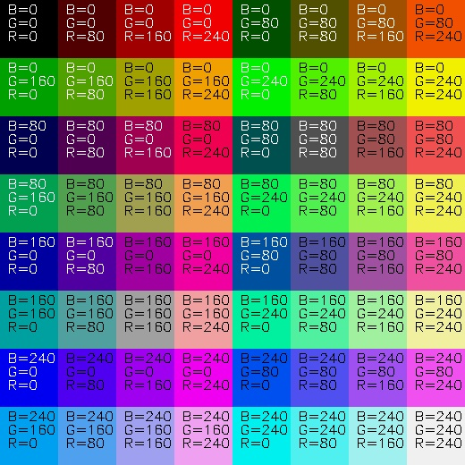
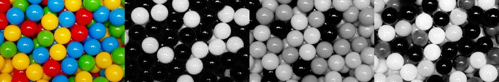
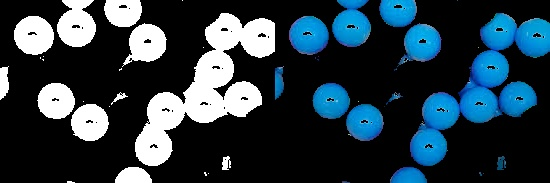
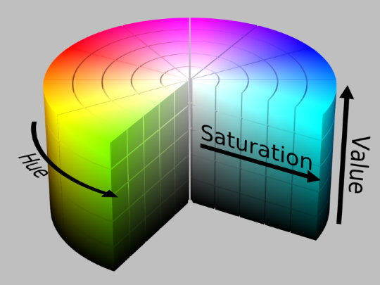
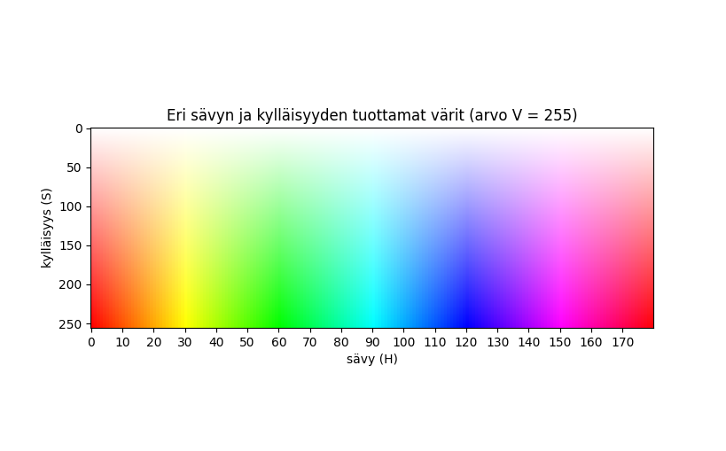
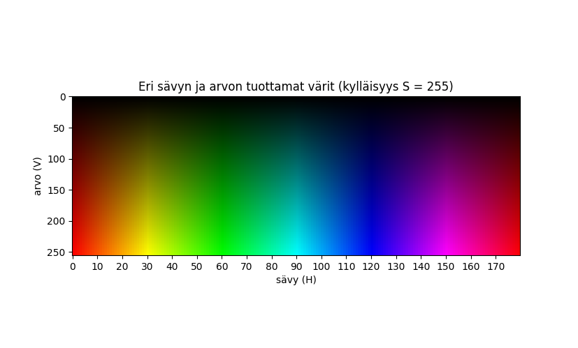

# Värien esittäminen digitaalisissa kuvissa

## RGB/BGR-värimalli

### Yleistä

RGB/BGR-värimalli on ns. standarditapa esittää värit digitaalisessa kuvassa, ja sitä olemme jo käsitelleet johdannossa. Tässä värimallissa väri siis esitetään punaisen, vihreän ja sinisen eli valon päävärien avulla. Jos kyseessä on 24-bittinen värikuva (joka on yleisin kuvamuoto), jokainen näistä pääväreistä saa 8 bittiä eli 256 sävyä. Mitä enemmän värisväyssä on kyseistä pääväriä, sitä lähempänä 255:ä sen arvo on. Alla oleva kuva havainnollistaa päävärien sekoittumisen BGR/RGB-värimallissa ja sen alla oleva kuva esittää muutamia värejä sekä ne esitettynä BGR-värimallissa.

.png) \
*RGB/BGR-värimallia havainnollistava kuvio: punainen, vihreä ja sininen sekä niiden välivärit.. (Ferlixwangg, CC BY-SA 4.0 <https://creativecommons.org/licenses/by-sa/4.0>, via Wikimedia Commons)*

 \
*Muutamia värisävyjä sekä samat värisävyt esitettynä BGR-värimallissa.*

Yleensä arvot annetaan järjestyksessä punainen, vihreä, sininen (R, G, B), mutta OpenCV:ssä värit annetaan järjestyksessä sininen, vihreä, punainen (B, G, R). Esim. yllä olevan kuvan alarivin keskellä oleva turkoosi ilmaistuna BGR:nä on (240, 240, 0). Huomioi, että koska kyse on valosta, värimalli on *additiivinen* eli lisäävä: värejä sekoittamalla valon määrä kasvaa. Kaikkia värejä sekoittamalla saadaan valkoista. Väripigmenttien, esim. maalien, tapauksessa sekoittuminen on *subtraktiivista* eli vähentävää: värejä sekoittamalla lopputuloksesta heijastuvan valon määrä vähenee. Kaikkia värejä sekoittamalla saadaan mustaa.

BGR/RGB-värimallia käytetään värien esittämiseen muun muassa tietokoneen näytöllä ja televisiovastaanottimessa. Niiden näyttölaitteiden pikselit koostuvat punaisen, vihreän ja sinisen värisistä valonlähteistä, nykyisin ledeistä. BGR/RGB-arvo siis kertoo värin tuottamiseen vaadittavat suhteelliset kirkkaudet kullekin pikselin valonlähteelle.

### Tietyn värisen alueen löytäminen kuvasta BGR-mallin perusteella

Koska BGR-kuvassa on tavallaan kolme tasoa (niitä kutsutaan myös värikanaviksi), voidaan kuva hajottaa väritasoihinsa yksinkertaisesti käyttämällä hyväksi tietoa värien järjestyksestä kuvassa. Värikanavat saa omaksi harmaasävykuvakseen määrittelemällä, että otetaan kuvasta vain sen ensimmäinen, toinen tai kolmas taso.

        b = kuva[:, :, 0]
        g = kuva[:, :, 1]
        r = kuva[:, :, 2]

OpenCV:ssä on myös komento `split`, jota voidaan hyödyntää kuvan hajottamisessa:

    b, g, r = cv2.split(kuva)

Kun nyt alkuperäinen värikuva esitetään vierekkäin sen värikanavien kanssa, havaitaan, että yksittäistä kanavaa esittävässä harmaasävykuvassa kyseistä väriä esittävät alueet ovat hyvin vaaleita. Alla oleva kuva havainnollistaa tätä.

 \
*Vasemmalta oikealle: alkuperäinen kuva ja sen B-, G- ja R-kanavat.*

Toinen vasemmalta on alkuperäisen kuvan sininen kanava. Kuten nähdään, kirkkaimpina kuvassa näkyvät alkuperäisen kuvan sinisiä palloja esittävät alueet. Niinpä kuva on mahdollista segmentoida binäärikuvaksi, jossa ainoastaan siniset alueet ovat valkoisia ja muut mustia harmaasävykuvaosiossa esitellyllä `threshold`-komennolla seuraavasti:

    _, bmv = cv2.threshold(b, 100, 255, cv2.THRESH_BINARY)

Kynnystettyä kuvaa bmv voidaan käyttää maskina alkuperäiseen kuvaan kuten osion laskutoimitukset binäärilaskutoimituksia käsittelevässä kappaleessa näytettiin. Näin saadaan tuloskuva, jossa pitäisi olla vain sinisiä alueita. Se nähdään koodinpätkän alla.

    b_maskattu = cv2.bitwise_and(kuva, kuva, mask=bmv)

 \
*Sininen maski ja sillä maskattu alkuperäinen kuva.*

Kuten nähdään, maskatussa kuvassa näkyvät kyllä siniset pallot, mutta lisäksi siinä näkyvät kaikki pallojen valkoiset kiillot. Tämä johtuu siitä, että valkoinen väri BGR:nä on (255, 255, 255), joten valkoisessa on myös paljon sinistä. Jos halutaan erottaa kuvasta pelkästään siniset alueet, pitää siis ottaa huomioon myös se, ettei näissä alueissa saa olla kovin paljoa punaista ja vihreää. Kynnystäminen voidaan tehdä siis manuaalisesti luomalla ensin kokonaan musta kuva, ja määrittelemällä valkoisiksi alueet, joissa on paljon sinistä, muttei paljoa punaista tai vihreää. Saatu tulos on koodinpätkän alla.

    bmv2 = np.zeros_like(b)
    bmv2[b > 100] = 255
    bmv2[g > 200] = 0
    bmv2[r > 150] = 0

 \
*Toisin määritelty sininen maski ja sillä maskattu alkuperäinen kuva.*

Tälle nimenomaiselle siniselle sävylle edellinen manuaalinen kynnystys toimi, mutta se ei ole yleiskäyttöinen eli se ei toimi välttämättä kaikille sinisen sävyille.

Vielä huonompi tilanne on esimerkkikuvamme vihreällä ja punaisella kanavalla. Vihreät pallot näkyvät kyllä hyvin vaaleina vihreää kanavaa esittävässä kuvassa, mutta keltaiset pallot ovat jopa vaaleampia ja myös siniset pallot ovat melkein yhtä vaaleita kuin vihreät. Keltainen väri saadaan BGR-mallissa sekoittamalla vihreää ja punaista, joten keltaisessa on hyvin paljon vihreeä. Pallojen sinisessä värissä on näköjään myös kohtalaisen paljon  vihreää. Keltaiset pallot näkyvät myös punaista kanavaa esittävässä kuvassa kirkkaampina kuin punaiset pallot.

On mahdollista luoda vastaavat säännöt myös vihreälle ja punaiselle kuin siniselle värille aiemmin. Näin saadaan binäärikuvat, joissa näkyy vain punaisten ja vihreiden pallojen alueet ja näitä binäärikuvia voi taas käyttää maskina kuten sinisenkin tapauksessa. On kuitenkin selvää, että tämä on hyvin työläs tapa erotella erivärisiä alueita kuvasta, sillä jokainen eri sävy vaatii tarkan tutkinnan, jotta löydetään oikeat kynnykset.

## HSV-värimalli

### Yleistä

Kuten edellä nähtiin, eriväristen alueiden erottelu kuvasta on varsin työlästä BGR/RGB-värimallia käyttämällä. Tämä onnistuu huomattavasti helpommin HSV-värimallilla, joka on suunniteltu värien intuitiivisemmaksi esitystavaksi. Tätä värimallia hyödynnetään värin valinnan käyttöliittymässä useimmissa kuvankäsittelyohjelmissa. HSV-värimallin kirjaimet tulevat sanoista hue, saturation, value eli sävy, kylläisyys ja arvo. Toisinaan värimallista käytetään myös nimitystä HSB, jossa kirjain B tulee sanasta brightness, kirkkaus. Värimallia voi kuvata lieriöllä, jonka kehällä sävy kiertää jatkuvana: se alkaa punaisesta, muuttuu oranssin ja keltaisen kautta vihreäksi, sitten turkoosin kautta siniseksi ja taas violetin kautta punaiseksi. Värikylläisyys kasvaa keskeltä kohti reunoja. Väri taas tummuu kohti mustaa kuljettaessa pinnalta kohti lieriön pohjaa.

 \
*HSV-värimallin havainnollistava kiekko. (HSV_color_solid_cylinder.png: SharkDderivative work: SharkD  Talk, CC BY-SA 3.0 <https://creativecommons.org/licenses/by-sa/3.0>, via Wikimedia Commons)*

Sävy, kylläisyys ja arvo määritellään kaikki numeerisesti eli tietty väri ilmaistaan kolmella kokonaisluvulla myös tässä värimallissa. Määrittely tosin saattaa olla hieman erilainen eri ohjelmissa ja kirjastoissa. Esimerkiksi Adobe Photoshopissa sävy määritellään välillä 0&ndash;359 (intuitiivisesti ympyrän kehän asteet lieriöllä) ja kylläisyys ja arvo molemmat 0&ndash;100 %. Microsoft Powerpointissa sävy, kylläisyys ja arvo määritellään kaikki välillä 0&ndash;255, eli 8-bittisinä lukuina. OpenCV on näiden välimuoto: sävy määritellään välillä 0&ndash;180 ja kylläisyys ja arvo välillä 0&ndash;255. OpenCV pelaa siis myös 8-bittisillä luvuilla, mutta sävyn perusajatus on silläkin ympyrän kehä (jaettuna kahdella).

Punainen sävy kattaa OpenCV:ssä arvot 0&ndash;10 ja 170&ndash;180, vihreä 40&ndash;60 ja sininen 110&ndash;130. Alla oleva kuva näyttää eri värit niiden sävy- ja kylläisyysarvon funktiona arvon V ollessa vakio. Seuraava kuva taas näyttää värit eri sävylle ja arvolle, kun kylläisyys pidetään vakiona.

### Tietyn värisen alueen löytäminen kuvasta HSV-mallin perusteella

Etsittäessä tietyn värisiä alueita voidaan sävyväli valita edellisten kuvien perusteella. Hyvä alkuarvaus on pitää kylläisyyttä ja arvoa molempia välillä 50&ndash;255. Tällöin kaikista alhaisimman kylläisyyden harmahtavat alueet sekä kaikista tummimmat jo mustaa lähellä olevat alueet eivät tule mukaan. Nehän eivät varsinaisesti enää esitä sävyn mukaista väriä.

Palataan aiemmin käyttämäämme kuvaan eri värisistä palloista. Etsitään HSV-värimallia käyttämällä sinisten pallojen alueet kuvasta. Ensin muutetaan kuva HSV-värimalliin käyttämällä funktiota `cvtColor`. Tällöin jokainen pikseliarvo muuttuu BGR:stä HSV:ksi. Funktiolle annetaan ensimmäiseksi parametriksi kuva ja toiseksi parametriksi värimuunnos (mistä mihin). Tätä funktiota voi käyttää myös värikuvan muuntamiseen harmaasävyksi ja harmaasävyn muuntamiseen värikuvaksi (värejä ei tällöin tietenkään kuvaan ilmesty, mutta se muuttuu kolmikanavaiseksi). Tällöin muunnokset ovat `COLOR_BGR2GRAY` ja `COLOR_GRAY2BGR`.

    kuva = cv2.imread("varit/pallot.jpg")
    kuva_hsv = cv2.cvtColor(kuva, cv2.COLOR_BGR2HSV)

Sen jälkeen määritellään etsittävän värin HSV-arvojen ala- ja ylärajat. Koska pallojen sävy oli turkoosiin päin, otetaan tämä huomioon arvoissa.

    alaraja = (85, 50, 50)
    ylaraja = (130, 255, 255)

Seuraavaksi määritellään maski funktion `inRange`, HSV-mallisen kuvan ja määriteltyjen rajojen avulla. Sitten maskataan kyseisellä maskilla alkuperäistä BGR-tyyppistä kuvaa. Maski ja lopputulos esitellään koodinpätkän jälkeen.

    maski = cv2.inRange(kuva_hsv, alaraja, ylaraja)
    maskattu = cv2.bitwise_and(kuva, kuva, mask=maski)

 \
*HSV-värimallin avulla haettu sinisten pallojen alueiden maski ja sillä maskattu kuva.*

Hyvä lopputulos saatiin huomattavasti vähemmällä vaivalla kuin BGR-värimallin tapauksessa. Vihreät alueet saadaan kuvasta täysin vastaavalla tavalla, mutta pitää vain määritellä eri rajat HSV-arvoille. Koska vihreänkin sävy on murrettu, valitaan sen ylärajaksi jo turkoosin puolella oleva 80. Käytettäessä ns. standardiylärajaa 60, pallojen reunoihin jää jonkin verran aukkoja. Siistimpi lopputulos saadaan käyttämällä ylärajaa 80. Sopivat arvot löytää yleensä nopeahkosti kokeilemalla.

    alaraja = (40, 50, 50)
    ylaraja = (80, 255, 255)

 \
*HSV-värimallin avulla haettu vihreiden pallojen alueiden maski ja sillä maskattu kuva.*

## Tehtäviä

1. Etsi vihreiden ja punaisten pallojen alueet käyttämällä BGR-värimallia ja loogisia operaatioita. Luo siis maskit ja maskatut kuvat.
2. Kokeile näyttää HSV-värimalliin muunnettu kuva komennolla `imshow`. Koska komento odottaa BGR-värimallia käyttävää kuvaa, värit ovat aika villit.
3. Luo punaisen värin maski käyttämällä HSV-värimallia ja maskaa esimerkkinä käytetty kuva pallot.jpg. Huom! Koska punainen väri on kahdessa kohdassa, sinun täytyy määritellä kahdet ala- ja ylärajat, tehdä kaksi maskia niiden avulla ja sitten yhdistää nämä maskit.
4. Etsi ääriviivat edellisestä maskikuvasta, ja piirrä ääriviivat alkuperäiseen BGR-kuvaan. Näin näet alkuperäisestä kuvasta, mitkä alueet löydettiin.
5. Kokeile livevärinetsintää tietokoneesi web-kameraa käyttäen. Heiluta kameran edessä vaikka tomaattia, appelsiinia tms. yksiväristä kohdetta ja pyri löytämään se automaattisesti kuvasta HSV-värimallin avulla.

### Kurssin rakenne
**[Johdanto](01-johdanto.md) | [Kuvien lukeminen](02-kuvien_lukeminen.md) | [Laskutoimitukset](03-laskutoimitukset.md) | [Harmaasävykuva](04-harmaasavykuva.md) | Värit | [Esi- ja jälkikäsittely](06-esi_ja_jalkikasittely.md) | [Hough-muunnokset](07-hough.md)**