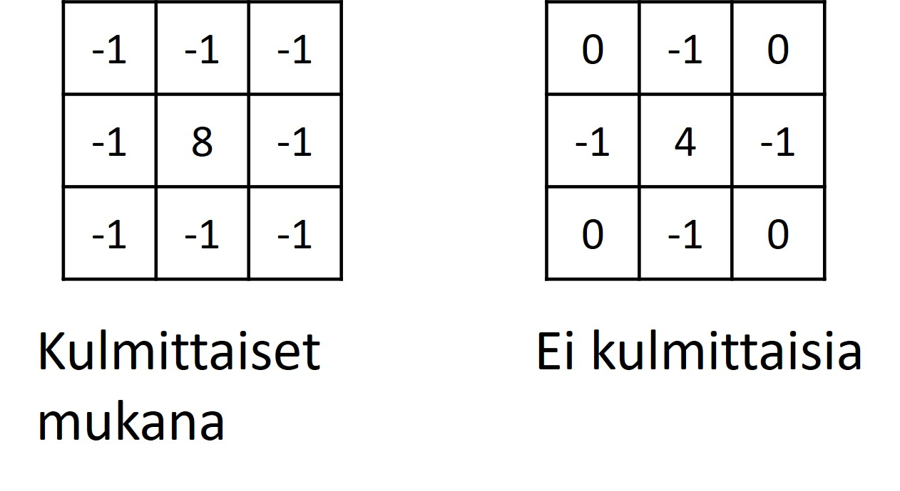

# Esi- ja jälkikäsittely

## Esikäsittely
Toisinaan kuvaa täytyy parantaa jotenkin ennen segmentointia, jotta segmentointi onnistuu paremmin. Kuvasta täytyy ehkä häivyttää tai korostaa jotain yksityiskohtia. Tätä kutsutaan esikäsittelyksi.

### Suodatuksen periaate

Tyypillinen esikäsittelyssä käytetty tekniikka on suodatus. Suodatus pohjautuu erilaisiin kerneleihin. Kernel on pieni taulukko, jonka sisältää kokonaislukutyyppisiä kertoimia. Sen leveys ja korkeus ovat parittomia ja usein samoja. Tyypillisiä kernelin kokoja ovat esim. 3x3, 5x5, 7x7 jne. Kernelin mitat ovat parittomia, sillä sillä täytyy olla keskikohta. Keskikohta ilmaisee painon, joka käsiteltävällä pikselillä on lopputulokseen. Muut kertoimet ilmaisevat viereisten pikseleiden painot. Suodatuksessa siis tuloskuvan jokaisen pikselin arvo riippuu alkuperäisen kuvan vastaavasta pikselistä sekä sen ympäristöstä. Kernelin kertoimet ilmaisevat näiden pikselien painot. Kerneliä tavallaan liu´utetaan pitkin kuvaa vasemmasta yläkulmasta oikealle ja rivi kerrallaan alaspäin. Näin lasketaan jokainen tuloskuvan pikseliarvo. Alla oleva animaatio havainnollistaa tätä.

 \
*Suodatusta havainnollistava animaatio. 3x3-kernel rullaa kuvan läpi ja suodattaa kuvan. Tuloksena on terävöitetty kuva. (Michael Plotke, CC BY-SA 3.0 <https://creativecommons.org/licenses/by-sa/3.0>, via Wikimedia Commons)*

Yllä olevassa esimerkissä tuloksena on terävöitetty kuva. Miksi? Koska tuloskuvassa alunperinkin suuret pikseliarvot ovat kasvaneet (7&rarr;9, 6&rarr;8) ja pienet ovat pienentyneet (3&rarr;1, 2&rarr;0). Näin ollen kontrastierot ovat suurentuneet ja kuva on näin muuttunut terävämmäksi.

### Pehmennys

Usein kuvassa on liikaa yksityiskohtia tai kohinaa, ja silloin on tarve pehmentää kuvaa, jotta nämä saadaan poistettua. Yleensä kuitenkin toivotaan, että reunat olisivat nähtävissä selkeästi. OpenCV:ssä on useampi pehmennysoperaatio: `blur`, `GaussianBlur`, `medianBlur` ja `bilateralFilter`. Nämä funktiot toteuttavat erilaisen pehmennyksen erilaisiin käyttötarkoituksiin, mutta niitä käytetään hyvin samalla tavalla: ensimmäisenä parametrina annetaan pehmennettävä kuva ja toisena käytettävän pehmentävän suodattimen koko. Keskiarvopehmennyksen toteuttava `blur` ja gaussilaisen pehmennyksen toteuttava `GaussianBlur` käyttävät staattista kerneliä samaan tapaan kuten kappaleessa Suodatuksen periaate kerrottiin. Mediaanipehmennyksen toteuttava `medianBlur` ja bilateraalisuodatuksen toteuttava `bilateralFilter` ovat puolestaan epälineaarisia suodattimia, eli niiden kernelit on määritelty hieman eri tavalla.

#### Keskiarvopehmennys `blur`

Keskiarvopehmennys laskee keskiarvon kernelinsä alaisista pikseleistä. Kernelin painojen summa on siis aina yksi. 3x3-kokoisen suotimen kernelin jokainen paino on $\frac{1}{9}$, 5x5-kokoisen $\frac{1}{25}$, 7x7-kokoisen $\frac{1}{49}$ jne. Seuraava kuva esittelee keskiarvopehmennyksen 3x3- ja 5x5-kokoisen kernelin.

 \
*Kokojen 3x3 ja 5x5 keskiarvosuodinten kernelit.*

Kernelin koko annetaan funktiolle `blur` tuplena eli lukuparina (leveys, korkeus), esim. (3, 3) tai (5, 9). Komento on siis seuraavanlainen. Lopputulos esitellään koodinpätkän jälkeen.

    kuva_pehm = cv2.blur(kuva, (5, 5))

 \
*Esimerkki `blur`-funktion käytöstä. Alkuperäinen kuva ja suodatukset koilla 3x3, 9x9 ja 21x21.*

#### Gaussilainen pehmennys `GaussianBlur`

Myös gaussilaisen pehmennyksen tuottavan suotimen kernelin kaikkien painojen summa on yksi. Kernelin painot lähellä keskipistettä ovat kuitenkin suuremmat kuin reunoilla. Näin ollen se painottaa käsiteltävän pikselin lähimpiä pikseleitä enemmän kuin siitä etäämmällä olevia. Näin se säilyttää reunat kuvassa paremmin kuin keskiarvosuodin. Gaussilaisen pehmennyssuotimen kertoimet noudattavat kaksiulotteisen Gaussin kellokäyrän muotoa, siitä sen nimi. Suodin poistaa tehokkaasti normaalijakautunutta kohinaa. Seuraava kuva esittelee kokojen 3x3 ja 5x5 kernelit gaussilaiselle pehmennyssuotimelle. Sitä seuraava kuva havainnollistaa 2D-kellokäyrää. Käyrän huippu on kuvaa siis kernelin keskikohtaa ja siitä lähdetään laskeutumaan samassa suhteessa kuin painot pienenevät.

 \
*Kokojen 3x3 ja 5x5 gaussilaisten pehmennyssuodinten kernelit.*

 \
*Gaussin käyrän 2D-versio (Kghose at the English-language Wikipedia, CC BY-SA 3.0 <http://creativecommons.org/licenses/by-sa/3.0/>, via Wikimedia Commons).*

 Funktiolla `GaussianBlur` on kuvan ja kernelin koon lisäksi kolmas pakollinen parametri `sigmaX` ja sen lisäksi valinnainen parametri `sigmaY`. Sigma ($\sigma$) tarkoittaa keskihajontaa ja sillä voi vaikuttaa kellokäyrän muotoon, kuten seuraava kuva näyttää. Parametrit `sigmaX` ja `sigmaY` siis määrittävät, kuinka jyrkästi painot putoavat X- ja Y-suuntaan. Yleensä `sigmaX`:n arvona käytetään nollaa, ja tällöin sen arvo lasketaan kernelin koon perusteella siten, että suodin "leviää" mahdollisimman laajasti kernelin alueelle. Parametrin `sigmaY` oletusarvo on niin ikään nolla, mikä tarkoittaa, että sen arvona käytetään samaa kuin `sigmaX`:n. Jos taas kernelin kooksi annetaan (0, 0), kernelin koko lasketaan annetun/annettujen sigma-arvojen avulla.

 \
*Gaussin käyrä eri keskihajonnoilla ($\sigma$) ja huipun paikalla ($\mu$).*

Funktiota käytetään seuraavalla tavalla. Koodinpätkän jälkeen esimerkki eri kernelin koilla suodatetuista kuvista.

    kuva_pehm = cv2.GaussianBlur(kuva, (5, 5), 0)

 \
*Esimerkki `GaussianBlur`-funktion käytöstä. Alkuperäinen kuva ja suodatukset koilla 3x3, 9x9 ja 21x21.*

#### Mediaansuodin `medianBlur`

Mediaanisuodin ei käytä samanlaista painokertoimiin perustuvaa kerneliä kuin kaksi edellistä. Siinä uusi pikseliarvo määritellään kernelin alla olevien piskeliarvojan mediaanina. Mediaansuodin säilyttää reunat selkeinä, ja poistaa tahokkaasti piikkimäistä kohinaa eli kohinaa, jossa on suuri ero ympäristöön, esim. valkoisia tai mustia pisteitä (ns. suola-pippurikohinaa).

Mediaanisuotimelle kernelin koko annetaan yhtenä lukuna, jolloin kernel on aina neliön muotoinen. Alla esimerkkikomento sekä suodatustuloksia eri kokoisilla kerneleillä.

    kuva_pehm = cv2.medianBlur(kuva, 5)

 \
*Esimerkki `medianBlur`-funktion käytöstä. Alkuperäinen kuva ja suodatukset koilla 3x3, 9x9 ja 21x21.*

#### Bilateraalinen suodin `bilateralFilter`

Bilateraalinen suodin on niin ikään epälineaarinen suodin, joka säilyttää reunat hyvin. Sen painot riippuvat sekä pikselien kernelin keskipisteestä että pikselien värien eroavuudesta kernelin keskipisteen pikselin väristä. Painot siis muuttuvat paikan mukaan. Suodin säilyttää reunat hyvin, sillä reunojen väri eroaa yleensä tasaisemman alueen väristä. Näin ollen reunat eivät herkästi sekoitu tasaiseen alueeseen. Kuvan ja kernelin koon (nyt annetaan taas yhdellä luvulla) lisäksi funktiolle annetaan parametrit `sigmaColor` ja `sigmaSpace`, joista ensimmäinen määrittää pehmennettävien pikselien maksimieron värissä ja toinen taas niiden maksimietäisyyden kernelin keskipisteestä. Arvot liikkuvat yhdestä useisiin kymmeniin. Bilateraalisen suotimen lopputuloksessa reunat ovat hyvin selkeitä, mutta suodin on paljon hitaampi kuin muut esitellyt pehmennyssuotimet. Nopeudella on merkitystä online- ja reaaliaikasovelluksissa.

Myös funktio `bilateralFilter` ottaa kernelin koon yksittäisenä lukuna eli kernelin leveys ja korkeus ovat aina samat. Alla esimerkkikomento sekä suodatustulokset muutamilla eri kernelin koilla.

    kuva_pehm = cv2.bilateralFilter(kuva, 5, 75, 75)

 \
*Esimerkki `bilaterFilter`-funktion käytöstä. Alkuperäinen kuva ja suodatukset koilla 3x3, 9x9 ja 21x21. Tässä parametrit `sigmaColor` ja `sigmaSpace` olivat molemmat 75.*

### Reunojen etsintä

Usein reunat ovat kiinnostavia alueita kuvassa. Reuna-alueet voidaan etsiä tehokkaasti suodatuksen avulla. Perustana on se, että reuna-alueilla tapahtuu hyppy pikseliarvoissa: tumman reunan kohdalla arvoissa tulee äkillinen muutos alaspäin ja vaalean reunan kohdalla ylöspäin. Reunaa etsivien suodinten kernelit on siis suunniteltu niin, että tasaisella alueella ne tuottavat alhaisia arvoja (eli liki mustaa), mutta muutoskohdissa ne tuottavat korkeita arvoja (liki valkoista).  OpenCV:ssä on kolme eri reunanetsintäsuodinta: Laplace-suodin, Sobel-suodin ja Canny-suodin. Kaikkia näitä voidaan käyttää vain harmaasävykuville.

#### Laplace-suodin

Laplace-suotimen toteuttaa funktio `Laplacian`. Sille on määritelty kaksi vaihtoehtoista kerneliä: yksi, joka ottaa kulmittaiset eli viistot reunat huomioon ja toinen, joka ei. Kernelit on esitelty alla.

 \
*Laplace-suotimen kernelit.*

Pythonin funktio `Laplacian` käyttää olestuksena kulmittaiset reunat huomioon ottavaa kerneliä. Funktiota kutsutaan antamalla ensimmäisenä parametrina suodatettava kuva ja toisena tuloskuvan tyyppi. Jos toiseksi parametriksi antaa -1:n, tuloskuva on samaa tyyppiä kuin suodatettava kuva. Siis kun suodatettava kuva on uint8-tyyppiä, myös tuloskuva on uint8-tyyppiä. 

    kuva_laplace = cv2.Laplacian(kuva, -1)

 \
*Esimerkki Laplace-suodatuksesta. Alkuperäinen kuva ja suodatustulos.*

Tuloskuvan tyyppi saattaa kuulostaa hassulta parametrilta. Syy sen käyttöön on, että laskevien reunojen (vaalean alueen muutos tummaksi) kohdalla suodin tuottaa negatiivisia arvoja. Jos tuloksen haluaa uint8-tyyppisenä, negatiiviset arvot muuttuvat nolliksi eli tuloskuvassa ei näy laskevia reunoja. Edellisessä tuloskuvassa näkyvät siis vain nousevat reunat. Jos halutaan tulokseen sekä nousevat että laskevat reunat, pitää tuloskuva määritellä jossain toisessa lukutyypissä (esim. 64-bittisinä liukulukuina), ottaa tuloksesta itseisarvo ja sen jälkeen muuttaa tuloskuva takaisin uint8-maailmaan.

    kuva_laplace = cv.Laplacian(kuva, cv.CV_64F)
    kuva_laplace = np.abs(kuva_laplace)
    kuva_laplace = np.uint8(kuva_laplace)

Funktiolla `Laplacian` on lisäksi useita valinnaisia parametreja. Ensimmäinen valinnainen parametri määrittelee kernelin koon. Se voi olla 1, 3, 5 tai 7. Koolla 1 käytetään kerneliä, joka ei ota huomioon kulmittaisia reunoja eli kernelit esittelvän kuvan oikeanpuoleista kerneliä.

       kuva_laplace = cv2.Laplacian(kuva, -1, 1)

#### Sobel-suodin

Sobel-suotimessa on kernelit erikseen vaakasuorille ja pystysuorille reunoille. Kernelit on esitelty alla.

 \
*Sobel-suotimen kernelit.*

Sobel-suotimen nollasta poikkeavat rivit/sarakkeet ovat etumerkkiä vaille samat kuin 3x3-kokoisessa gaussilaisessa suotimessa. Sobel-suodin siis hieman pehmentää kuvaa ensiksi ja on siten vähemmän herkkä kohinalle kuin Laplace-suodin. Nollariviä/saraketta edeltävä rivi on negatiivinen ja seuraava positiivinen. Kernel siis vähentää seuraavasta rivistä tai sarakkeesta edellisen. Tasaisella alueella se siis tuotta liki nollaa, pikseliarvojen äkisti noustessa positiivisia arvoja (vaaleaa) ja arvojen laskiessa negatiivisia arvoja.

Funktion `Sobel` ensimmäiset kaksi parametria määritellään samoin kuin funktiota `Laplacian` käytettäessä: ne ovat suodatettava kuva ja tuloskuvan tyyppi. Laskevat reunat saadaan tuloskuvaan vain käyttämällä laajempaa lukualuetta kuin uint8, kuten Laplace-suotimen kanssa näytettiin. Seuraavat kaksi parametria tarkoittavat x:n suuntaista ja y:n suuntaista astetta. Yleensä toisena käytetään ykköstä ja toisena nollaa. Näin saadaan joko x:n tai y:n suuntainen erotus.

    kuva_sobel_x = cv2.Sobel(kuva, -1, 1, 0)
    kuva_sobel_y = cv2.Sobel(kuva, -1, 0, 1)

Alla toisen komennon tuottama lopputulos (y:n suuntainen erotus eli vaakasuorat reunat).

 \
*Esimerkki Sobel-suodatuksesta. Alkuperäinen kuva ja suodatustulos vaakasuorilla nousevilla reunoilla.*

Jos halutaan tuloskuvaan sekä pysty- että vaakasuorat reunat, tulokset summataan keskenään käyttämällä vaikka laskutoimituksissa esiteltyä funktiota `add`.

    kuva_sobel = cv2.add(kuva_sobel_x, kuva_sobel_y)

#### Canny-suodin

Canny-suodin tuottaa yhden pikselin paksuisen täysin valkoisen reunaestimaatin. Sen toiminta on mutkikkaampi kuin kahden edellistä. Se koostuu OpenCV:ssä neljästä vaiheesta:

1. pehmennys
2. Sobel-suodatus
3. lokaali maksimi
4. kynnystys

Ensin kuvasta poistetaan siis kohinaa ja lasketaan Sobelilla reunat. Näistä reunoista etsitään lokaalit maksimit eli kirkkaimat kohdat reunan paksuuden suuntaisesti. Reuna siis ohenee tässä yhden pikselin paksuiseksi. Seruaava kuva havainnollistaa maksimin estimistä reunan paksuuden suuntaisesti.

 \
*Havainnollistus reunan lokaalin maksimin etsimisestä. Maksimi etsitään nuolen suuntaan koko reunan pituudelta. Tuloksena on pikselinohuinen viiva.*

Viimeisessä vaiheessa reunat kynnystetään käyttämällä kahta kynnystä: Ensimmäinen kynnys tarkoittaa, että tätä arvoa korkeammista pikseliarvoista koostuvat reunat jätetään kuvaan. Toinen kynnys tarkoittaa, että sitä alemmmista pikseliarvoisa koostuvat reunat poistetaan kuvasta. Reunat, joissa on näiden kynnysten välillä olevia pikseliarvoja, jäävät kuvaan, jos niissä on myös ensimmäisen kynnysarvon ylittäviä pikseliarvoja. Siis haaleat reunat jäävät kuvaan vain, jos niissä on myös kirkkaita kohtia. 

 OpenCV:n funktiota `Canny` kutsutaan antamalla ensimmäiseksi parametriksi kuva, toiseksi matala kynnysarvo ja kolmanneksi korkea kynnysarvo. Sobel-kernelin koon (3, 5 tai 7) voi antaa valinnaisena neljäntenä parametrina. Oletuksena se on 3.

    kuva_canny = cv2.Canny(kuva, 100, 200)

 \
*Esimerkki Canny-suodatuksesta. Alkuperäinen kuva ja suodatustulos.*

Canny-reunantunnistinta kutsutaan toisinaan optimaaliseksi reunantunnistimeksi. Se tuottaa todella siistin lopputuloksen. Kuitenkin Sobel on nopeampi ja siksi houkuttelevampi reaaliaikaisiin sovelluksiin. Sobelilla voi myös määritellä, minkä suuntaisia reunoja etsii. Siksi sitä käytetään monissa menetelmissä esikäsittelyvaiheena.

## Jälkikäsittely

Jälkikäsittely tarkoittaa binäärisen kuvan muokkausta kynnystyksen jälkeen. Sillä tavoitellaan samaa kuin esikäsittelylläkin: tiettyjen piirteiden korostamista ja tiettyjen häivyttämistä. Nyt vain kyseessä on binäärikuva eli täysin mustavalkoinen kuva. Jälkikäsittelyllä siis pyritään poistamaan tai lisäämään valkoisia pikseleitä mustavalkokuvassa. Tietysti joskus binäärikuvaakin voidaan suodattaa vaikka pehmennysuotimella, mutta usein niiden ehostaminen tehdään niin sanotuilla *morfologisilla operaatioilla*. 

### Morfologiset operaatiot

Morfologiset operaatiot muistuttavat hyvin paljon suodattamista. Niissäkin kerneliä muistuttava ikkuna liukuu kuvan yli rivi kerrallaan. Erona on, että kernelin sijaan puhutaan rakenne-elementeistä, jotka puolestaan koostuvat painojen sijaan ykkösistä ja nollista eli ovat binäärisiä. Kerto- ja yhteenlaskujen sijaan rakenne-elementin arvojen ja binäärikuvan pikseliarvojen välillä tehdään loogisia operaatioita eli JA- ja TAI-operaatioita.

Rakenne-elementtien leveys ja korkeus ovat parittomia kokonaislukuja kuten kernelien tapauksessa. Koon lisäksi rakenne-elementeille määritellään muoto. Se tarkoittaa, minkä muodon elementin ykköset muodostavat. OpenCV:n käyttämiä muotoja ovat suorakulmio, ellipsi ja risti. OpenCV:ssä rakenne-elementti määritellään komennolla `getStructuringElement`, jolle annetaan parametriksi elementin muoto ja koko. Koon 11x11 suorakulmio, ellipsi ja risti luodaan seuraavasti:

    suorak_elem = cv2.getStructuringElement(cv2.MORPH_RECT, (11, 11))
    ell_elem = cv2.getStructuringElement(cv2.MORPH_ELLIPSE, (11, 11))
    risti_elem = cv2.getStructuringElement(cv2.MORPH_CROSS, (11, 11))

Seuraava kuva esittelee luodut elementit.

 \
*Erimuotoiset rakenne-elementit: suorakulmio, ellipsi ja risti.*

Käyttäjä voi tietysti luoda minkälaisia rakenne-elementtejä määrittelemällä ykkösistä ja nollista koostuvan taulukon Numpyn `array`-komennon avulla tai luomalla `zeros`-komennolla ensin nollista koostuvan taulukon ja muokkaamalla haluamansa solut ykkösiksi.

Morfologisista operaatioista yleisimmin käytettyjä ovat perusoperaatiota eroosio ja dilaatio ja niistä koostuvat avaaminen ja sulkeminen. Ne esitellään tässä tarkemmin. Morfologisista operaatioista on myös [oma sivunsa](https://docs.opencv.org/4.x/d9/d61/tutorial_py_morphological_ops.html) OpenCV:n dokumentaatiossa.

#### Eroosio

Eroosio tarkoittaa muodon hiomista siten, että muoto kapenee kaikista suunnista ja sen reiät kasvavat. Eroosiossa rakenne-elementti liukuu kuvan halki rivi kerrallaan ja tuloskuvaan tulee valkoinen pikseli rakenne-elementin kulloiseenkin keskikohtaan vain, jos kaikki rakenne-elementin ykkösten alla olevat pikselit ovat valkoisia. Suoritetaan siis JA-operaatio. [Tämä video](https://www.youtube.com/watch?v=b5lgnNEzGeU) havainnollistaa asiaa. Rakenne-elementin muoto vaikuttaa siihen, mitkä muodot katoavat, kuten [tämä video](https://www.youtube.com/watch?v=9UEzr3BakQo
) näyttää.

Eroosiota käytetään mm. ylimääräisen "roskan" poistamiseen kuvasta ja toisissaan kiinni olevien objektien irrotukseen. Se on tehokas tapa poistaa kaikki tiettyä kokoa pienemmät (mahdollisesti tiettyyn muottiin sopimattomat) objektit kuvasta, vrt. ääriviivojen etsimiseen, jokaisen läpikäymiseen silmukassa ja poistamiseen esim. pinta-alan perusteella. 

Kun käytössä on esim.`threshold`-funktiolla saatu binäärikuva ja rakenne-elementti on määritelty, eroosio toteutetaan funktiolla `erode`. Sen voi toteuttaa myös `morphologyEx`-funktiota käyttämällä:

    kuva_muokattu = cv2.erode(kuva_mv, suorak_elem)

    TAI

    kuva_muokattu = cv2.morphologyEx(kuva_mv, cv2.MORPH_ERODE, suorak_elem)

Jos sama operaatio halutaan toistaa useamman kerran &ndash; esimerkiksi viidesti &ndash;, se voidaan määritellä valinnaisella parametrilla

    kuva_muokattu = cv2.erode(kuva_mv, suorak_elem, iterations=5)

    TAI

    kuva_muokattu = cv2.morphologyEx(kuva_mv, cv2.MORPH_ERODE, suorak_elem, iterations=5)

Seuraava kuva näyttää eroosion kaikilla rakenne-elementeillä käyttämällä kokoja 5x5 ja 11x11. Isommalla elementillä tehdyissä operaatioissa elementin muoto pääsee paremmin esiin.

 \
*Esimerkki eroosiosta. Ylhäällä alkuperäinen kuva, sitten eroosiot suorakulmiolla, ellipsillä ja ristillä. Vasemmalla kokoina 5x5 ja oikealla 11x11.*

#### Dilaatio

Dilaatio on puolestaan muodon turvotusta. Muoto paisuu jokaisesta kohdasta ulospäin ja sen reiät pienenevät. Dilaatiossa rakenne-elementti liukuu kuvan halki rivi kerrallaan ja tuloskuvaan tulee valkoinen pikseli rakenne-elementin kulloiseenkin keskikohtaan, jos yhdenkin rakenne-elementin ykkösen alla on valkoinen pikseli. Suoritetaan siis TAI-operaatio. [Tämä video](https://www.youtube.com/watch?v=3IJ8RFtlDLY) havainnollistaa asiaa.

Dilaatiota käytetään reikien, rakojen ja katkosten tilkitsemiseen. Sillä voi myös etsiä ääriviivoja: kun dilatoidusta kuvasta vähentää alkuperäisen mustavalkokuvan, saa tuloksena pelkkiä objektien reunoja esittävän kuvan.

Kun binäärikuva ja rakenne-elementti on määritelty, dilaatio toteutetaan funktiolla `dilate` tai `morphologyEx`. Myös siinä voidaan käyttää valinnaista parametria `itarations`.

    kuva_muokattu = cv2.dilate(kuva_mv, suorak_elem)

    TAI

    kuva_muokattu = cv2.morphologyEx(kuva_mv, cv2.MORPH_DILATE, suorak_elem)

Seuraava kuva näyttää dilaation kaikilla rakenne-elementeillä käyttämällä kokoja 5x5 ja 11x11.

 \
*Esimerkki dilaatiosta. Ylhäällä alkuperäinen kuva, sitten dilaatiot suorakulmiolla, ellipsillä ja ristillä. Vasemmalla kokoina 5x5 ja oikealla 11x11.*

#### Avaaminen

Avaaminen tarkoittaa peräkkäistä eroosiota ja dilaatiota. Ideana on poistaa ensin eroosiolla tiettyä kokoa pienemmät partikkelit kuvasta ja sitten turvottaa isommat muodot ennalleen dilaatiolla. Haluttu lopputulos on siis kuva, josta pienet kohteet ovat poissa.

Avaamisen voi tehdä peräkkäisillä `erode`- ja `dilate`-komennoilla, mutta sen voi touttaa myös yksittäisellä komennolla käyttämällä funktiota `morphologyEx`.

    kuva_muokattu = cv2.morphologyEx(kuva_mv, cv2.MORPH_OPEN, suorak_elem)

Seuraava kuva näyttää avaamisen kaikilla rakenne-elementeillä käyttämällä kokoja 5x5 ja 11x11.

 \
*Esimerkki avaamisesta. Ylhäällä alkuperäinen kuva, sitten avaamiset suorakulmiolla, ellipsillä ja ristillä. Vasemmalla kokoina 5x5 ja oikealla 11x11.*

#### Sulkeminen

Sulkeminen tarkoittaa peräkkäistä dilaatiota ja eroosiota. Ideana on kursia ensin raot ja reiät kiinni ja sitten hioa muodot muuten ennalleen eroosiolla. Haluttu lopputulos on siis kuva, josta määriteltyä pienemmät raot ja reiät ovat poissa.

Sulkemisen voi tehdä peräkkäisillä  `dilate`- ja `erode`-komennoilla, mutta sen voi touttaa myös yksittäisellä komennolla käyttämällä funktiota `morphologyEx`.

    kuva_muokattu = cv2.morphologyEx(kuva_mv, cv2.MORPH_CLOSE, suorak_elem)

Seuraava kuva näyttää sulkemisen kaikilla rakenne-elementeillä käyttämällä kokoja 5x5 ja 11x11.

 \
*Esimerkki sulkemisesta. Ylhäällä alkuperäinen kuva, sitten sulkemiset suorakulmiolla, ellipsillä ja ristillä. Vasemmalla kokoina 5x5 ja oikealla 11x11.*

## Tehtäviä

1. Kokeile eri pehmennyssuotimia omille kuvillesi. Kokeile kernelin koon vaikutusta. Huomioi reunojen selkeys.
2. Kokeile etsiä reunat Laplacella, Sobelilla ja Cannylla ensin pehmentämistäsi kuvista. Seuraa pehmennyksen vaikutusta lopputulokseen eli siihen, mitkä reunat tuloskuvaan jäävät. Muista, että reunanetsintä toimii vain harmaasävykuville.
3. Kokeile omille kuvillesi Cannyn kynnysten vaikutusta löydettyihin reunoihin. Aloita arvoilla 100, 200, ja muuttele ensin ensimmäistä arvoa ylös ja alas, ja sitten toista.
4. Kokeile eri morfologisia operaatioita omille kuvillesi. Muista kynnystää ne ensin. Yritä saada esiin tai häivyttää tiettyjä muotoja, kuten ympyröitä, ellipsejä tai suorakulmioita. Huomaa, että rakenne-elementtien ei tarvitse olla neliön muotoisia, voit siis antaa kooksi vaikka (5, 11). 
5. Kokeile morfologisia operaatiota harmaasävykuville. Kuten huomaat, funktiot kyllä toimivat, mutta lopputulos on hieman erilainen. Pystyt samaan tyyliin poistamaan pienikokoisia objekteja kuvasta.

### Kurssin rakenne
**[Johdanto](01-johdanto.md) | [Kuvien lukeminen](02-kuvien_lukeminen.md) | [Laskutoimitukset](03-laskutoimitukset.md) | [Harmaasävykuva](04-harmaasavykuva.md) | [Värit](05-varit.md) | Esi- ja jälkikäsittely | [Hough-muunnokset](07-hough.md)**