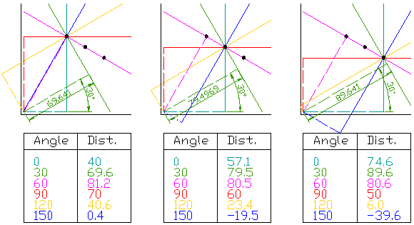
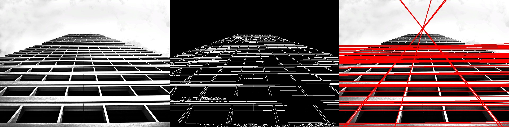
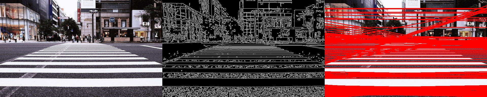
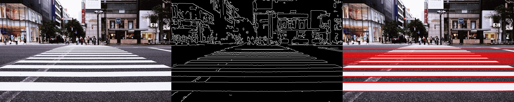
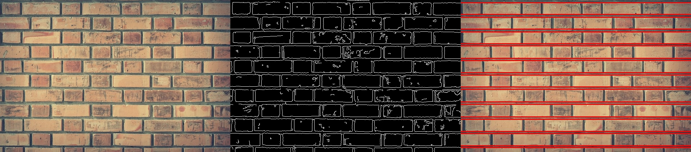
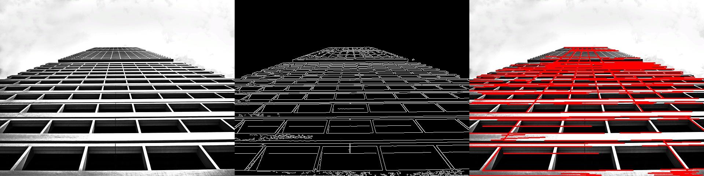
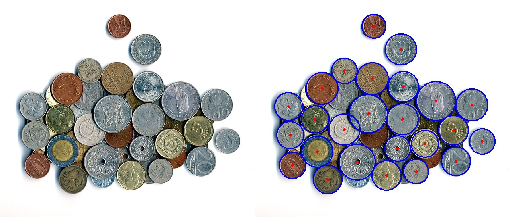
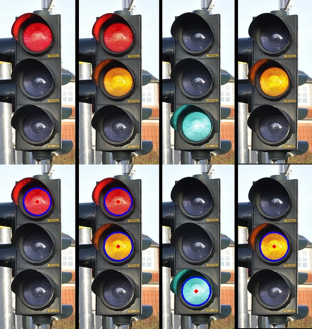
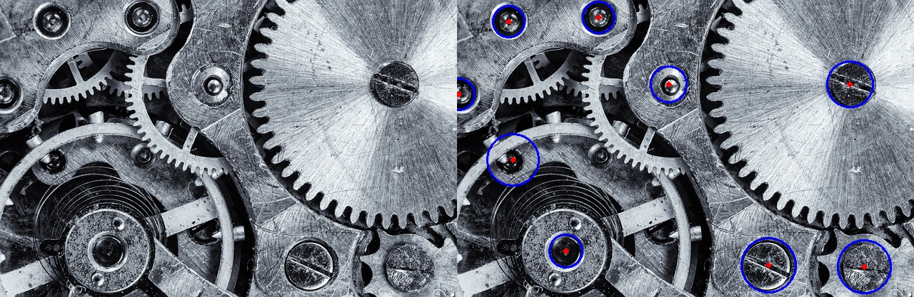

# Hough-muunnokset

Osiossa [harmaasävykuva](04-harmaasavykuva.md) esiteltiin ääriviivojen etsimistä ja niiden pohjalta tehtäviä sovituksia kuten viiva-, ympyrä- ja ellipsisovitusta. Nämä ovat tehokkaita keinoja silloin, kun yksittinen kyseistä muotoa esittävä ääriviiva saadaan eroteltua kuvasta. Kuitenkin usein kuvissa on suoraa tai ympyrää esittäviä muotoja, joita on hyvin vaikeaa irrottaa kuvasta: ne voivat olla osin peitossa tai osin päällekkäin tai niitä vain yksinkertaisesti on hyvin monta ja ne ovat kiinni toisisaan. Lisäksi monesti halutaan etsiä kuvasta viivoja tai ympyröitä ilman ennakkotietoa niiden sijainnista. Tätä varten on Hough-muunnokset.

## Houghin viivamuunnos

X&ndash;y-tasossa suora määritellään kahden parametrin avulla: kulmakertoimen $k$ ja y-akselin leikkauspisteen $c$ ($y = kx + c$). Houghin viivamuunnoksessa (yleensä puhutaan vain Hough-muunnoksesta) suoran kaksi parametria taas ovat sen etäisyys origosta $\rho$ ja kulma $\theta$, jonka sitä vastaan kohtisuora muodostaa x-akselin kanssa ($rho = x*cos\theta + y*sin\theta$). Alla oleva kuva esittelee nämä (tosin siinä käytetään *r*:ää $\theta$:n sijaan).

 \
*Suora, sen etäisyys origosta ja sen kohtisuoran kulma x-akselin kanssa*

Tämä ajattelutapa on lähtöisin napakoordinaatistosta, jossa jokainen piste määritellään kiertokulman ja säteen funktiona. Napakoordinaatiston mukainen piste on siis suoran ja sen kohtisuoran leikkauspiste ylemmässä kuvassa. Alla oleva kuva esittelee napakoordinaatiston periaatteen.

 \
*Napakoordinaatisto (Mets501, CC BY-SA 3.0 <http://creativecommons.org/licenses/by-sa/3.0/>, via Wikimedia Commons).*

Hough-muunnoksen esikäsittelynä kuvasta etsitään viivat esim. Canny-suotimella, joka oli yksi edellisen oppitunnin aiheista. Hough-muunnos toimii karkeasti siten, että jokaiselle kuvan x&ndash;y-pisteelle kokeillaan $\theta$:n arvoja tietyllä resoluutiolla. Jos resoluutiona käytetään yhtä astetta, pisteelle kokeillaan arvot 1&deg;, 2&deg;, 3&deg;, ..., 359&deg; ja 360&deg;. Etäisyys $\rho$ lasketaan kaavalla $rho = x*cos\theta + y*sin\theta$. Kaikki sadut $\rho$&ndash;$\theta$-parit laitetaan taulukkoon, ja jokaiselle lisätään yksi ääni. Sen jälkeen siirrytään seuraavaan pisteeseen ja toistetaan tämä. Jos jokin suora voi kulkea näiden kahden pisteen kautta, näillä pisteillä on yksi sama $\rho$&ndash;$\theta$-pari, ja se saa siis nyt toisen äänen. Näin jatketaan, kunnes kaikki pisteet on käyty läpi. Jos jotkin pisteet muodostavat kuvassa viivan, näillä pisteillä kaikilla on yhteinen $\rho$&ndash;$\theta$-pari, joka saa siis yhtä monta ääntä kuin näitä pisteitä on. Ne $\rho$&ndash;$\theta$-parit, joilla on yhtä paljon tai enemmän ääniä kuin on määritelty suoran löytymisen rajaksi, ovat Hough-muunnoksen tulokset eli kuvasta löydetyt suorat. Alla oleva kuva esittelee tämän periaatteen yksinkertaisen esimerkin avulla.

 \
*Hough-muunnoksen periaate. Tässä käytetään resoluutioa 30&deg;. Kaikkien pisteille lasketaan kaikilla $\theta$:n arvoilla vastaavat $\rho$:t ja näiden määrittämät suorat esitetään kuvissa vastaavilla väreillä. Lopputuloksesta nähdään, että $\rho$&ndash;$\theta$-pari ~81, 60&deg; saa kolme ääntä, muut parit yhden äänen. Tämän parin määrittelemä suora kulkee siis kaikkien kolmen pisteen kautta.*

Kuten kuva osoittaa, $\rho$ ei välttämättä ole tismalleen sama joka pisteessä. Tämän takia sillekin määritellään toleranssi. Hough-muunnoksen parametreja ovat siis:
1. etsinnässä käytettävä kulman $\theta$ resoluutio
2. tuloksia analysoitaessa käytettävä etäisyyden $\rho$ toleranssi
3. suoran toteuttavien pisteiden minimimäärä.

### OpenCV:n muunnos HoughLines

OpenCV:n funktio Hough-muunnokselle on `cv2.HoughLines`. Sille annetaan edellisten kolmen parametrin lisäksi tietysti kuva, jota analysoidaan. Yleensä annetaan Canny-reunanetsimen tuottama kuva. Alla oleva esimerkkikoodi näyttää funktion käyttämisen:

    kuva = cv2.imread("07-hough/pilvenpiirtaja.jpg")
    kuva_hs = cv2.cvtColor(kuva, cv2.COLOR_BGR2GRAY)

    # Etsitään reunat
    reunakuva = cv2.Canny(kuva_hs, 100, 200)
    cv2.imshow("reunat", reunakuva)

    # Etsitään suorat
    rho_reso = 1 # Yhden pikselin toleranssi
    theta_reso = np.pi / 180 # Asteen tarkkuus
    min_pisteet = 200 # Suoran toteuttavien pisteiden minimimäärä

    suorat = cv2.HoughLines(reunakuva, rho_reso, theta_reso, min_pisteet)

Kuva avattiin esimerkissä värillisenä ja sitten siitä tehtiin harmaasävyversio, koska löytyneet suorat halutaan piirtää värillisinä alkuperäiseen kuvaan. Harmaasävyversiota tarvitaan itse analyysiin, koska `Canny`-funktio vaatii harmaasvykuvan.

Suorat-muuttuja sisältää nyt listan, joka sisältää kaikki riittävästi ääniä saaneet $\rho$&ndash;$\theta$-parit. Suoran piirtämiseen OpenCV:ssä tarvitaan kaksi x&ndash;y-paria: suoran alkupiste ja loppupiste. Jotta suorat voi piirtää, pitää nämä parit ensin saada luotua $\rho$&ndash;$\theta$-pareista. Aluksi yksittäinen x&ndash;y-piste lasketaan yhtälöillä $x = \rho *cos \theta$ ja $y = \rho *sin \theta$. Sen jälkeen hyödynnetään kuvan lävistäjän pituutta ja lasketaan suoralta kaksi pistettä, jotka ovat vastakkaisissa suunnissa ja kuvan ulkopuolella eli lävistäjän mitan päässä lasketusta pisteestä. Tällöin voidaan olla varmoja, että piirretty suora menee koko kuvan halki (usein netistä löytyvissä esimerkeissä tässä käytetään vain suurta lukua kuten 1000, mutta se ei isoissa kuvissa riitä).

    # Tieto kuvan koosta piirtoa varten
    rivit, sarakkeet = kuva_hs.shape
    lavistaja = int(np.sqrt(rivit**2 + sarakkeet**2))

    # Käsitellään kaikki saadut rho - theta-parit ja piirretään
    # niiden määrittelemät suorat
    if suorat is not None:
        for s in suorat:
            rho, theta = s[0]
            a = np.cos(theta)
            b = np.sin(theta)
            x0 = a*rho
            y0 = b*rho
            x1 = int(x0 - lavistaja * b)
            y1 = int(y0 + lavistaja * a)
            x2 = int(x0 + lavistaja * b)
            y2 = int(y0 - lavistaja * a)

            cv2.line(kuva, (x1, y1), (x2, y2), (0, 0, 255), 1)

 \
*Esimerkki Houghin viivamuunnoksesta. Alkuperäinen kuva, Cannylla löydetyt reunat ja Houghin reunakuvasta löytämät viivat visualisoituna alkuperäisen kuvan päälle.*

Kohinan ja liian suuren yksityskohtien määrän takia viivoja löyytyy liian herkästi paikoista, joista ihmissilmä ei niitä löytäisi. Pehmennyssuodatus on siis usein hyödyllinen esikäsittelymenetelmä, kuten reunantunnistuksen yhteydessä mainittiin aiemmin. Seuraavat kaksi kuvaa demonstroivat tätä. Ensimmäisen kanssa käytettiin samaa skriptiä kuin edellisen pilvenpiirtäjää esittelevän kuvan kanssa, toisen kanssa käytettiin ennen Cannya mediaanisuodatusta 5x5-kernelillä. Mediaanisuodatus säilyttää reunat kohtalaisen terävinä, joten sitä käytetään usein Hough-muunnosten kanssa. Toki käytettävä pehmennys riippuu aina alkuperäisestä kuvasta, joten kannattaa aina kokeilla, millä saavutetaan paras lopputulos.

 \
*Esimerkki liiallisten yksityískohtien vaikutuksesta Houghin viivasovitukseen. Ylimääräisiä suoria löytyy tien epätasaisuuden takia löydetyistä reunoista sekä taustan rakennuksen yksityiskohdista.*

 \
*Kuvaa pehmentämällä ylimääräiset yksityiskohdat saadaan karsittua ja vain vahvemmat reunat jäävät näkyviin. Tässä alkuperäiselle kuvalle käytettiin 5x5-mediaanisuodatinta.*

Pieni pehmennys oli myös avuksi tämän kuvan kanssa. Jos etsitään vain vaaka- ja pystysuoria reunoja, voidaan lisäksi kulmaresoluutiota tiputtaa vaikka vain 90 asteeseen.

 \
*Tiiliseinän laastisauman reunojen löytäminen Hough-muunnoksella.*

### Probabilistinen Houghin viivamuunnos

OpenCV:ssä on Houghin viivamuunnoksesta myös toinen toteutus, probabilistinen Hough-muunnos `HoughLinesP`. Se ei käsittele kuvan kaikkia pisteitä, vaan pienemmän otoksen niistä. Näin se säästää aikaa. Funktio kokeilee, mitkä pisteet voisivat kuulua ehtojen mukaisesti tietyn pisteen kautta kulkevalle suoralle. Jo johonkin suoraan kuuluviksi määritellyille pisteille ei enää etsitä uudelleen suoria.

Tälle funktiolle annetaan edellisen funktion parametrien lisäksi kaksi lisäparametria `minLineLength` ja `maxLineGap`. Ensimmäinen nimensä mukaisesti määrittelee minimipituuden etsittäville suorille ja toinen maksimipituuden suorassa olevalle katkokselle. Funktiokutsu menee siis kokonaisuudessaan esimerkkikuvallemme näin:   

    suorat = cv2.HoughLinesP(reunakuva, 
                         rho_reso, 
                         theta_reso, 
                         min_pisteet,
                         minLineLength=50,
                         maxLineGap=10)

Koska tämä muunnos etsii lyhyempiä suorien segmenttejä, parametrin min_pisteet arvoa pitää laskea. Tässä on käytetty arvoa 100. Funktio palauttaa kustakin suorasta sen alku ja loppupisteen. Tämä helpottaa niiden piirtoa kuvaan. Se tehdään seuraavasti:

    if suorat is not None:
        for s in suorat:
            x1,y1,x2,y2 = s[0]
            cv2.line(kuva, (x1, y1), (x2, y2), (0, 0, 255), 2)

 \
*Esimerkki probabilistisesta Houghin viivasovituksesta.*

Kuten näkyy, funktio paikallistaa löytämänsä viivat. Se tosin helposti jakaa saman viivan useammaksi palaseksi, eli parametrien `minLineLength` ja `maxLineGap` arvojen määrittely tärkeää lopputuloksen kannalta.

## Houghin ympyräsovitus

Houghin ympyräsovituksen avulla etsitään puolestaan ympyröitä kuvasta. Esikäsittelynä käytetään jälleen Canny-reunantunnistus. Ennakkotietona on etsittävien ympyröiden säde. Kuvan pisteiden muodostamat ympyrät ovat löydettävissä piirtämällä samansäteisiä ympyröitä jokaisen kuvan pisteen ympärille (kuvan piste on siis ympyrän keskipiste). Jos riittävän moni piirretyistä ympyröistä leikkaa samassa pisteessä, on tämä piste sen ympyrän keskipiste, joka kulkee näiden kuvan pisteiden kautta. Seuraava kuva selventää asiaa.

 \
*Vasemmanpuoleinen kuva esittelee neljä pistettä, jotka kuuluvat punaisella piirretyn ympyrän kehälle. Oikeanpuoleisessa kuvassa on piirretty ympyrä kunkin pisteen ympärille. Näiden ympyröiden leikkauspiste (punainen piste keskellä) on vasemmanpuoleisen kuvan punaisen ympyrän keskipiste. Huomioi, että kuvat eivät ole samassa mittasuhteessa (1w2w3y, CC BY-SA 4.0 <https://creativecommons.org/licenses/by-sa/4.0>, via Wikimedia Commons).*

OpenCV:n funktio on `HoughCircles`. Funktiossa on sisänrakennettu Cannyn reunanetsintä, joten esikäsittelynä riittää pelkkä pehmennys. Lisäksi kuva pitää muistaa muuttaa harmaasävykuvaksi. Funktiolle annettavia parametreja ovat
1. käytettävä menetelmä (cv2.HOUGH_GRADIENT tai cv2.HOUGH_GRADIENT_ALT; loput parametrit kerrottu menetelmälle HOUGH_GRADIENT) 
2. herkkyys: hyvä alkuarvaus on 1 ja jos herkkyyttä haluaa laskea, lukua kasvatetaan
3. ympyröiden keskipisteiden minimietäisyys
4. Cannyn ylempi kynnys (alempi kynnys lasketaan jakamalla tämä kahdella)
5. ympyrän kehälle kuuluvien pisteiden minimimäärä

Esimerkki funktion käyttämisestä alla.

    kuva_hs = cv2.medianBlur(kuva_hs, 3, 0)

    herkkyys = 1
    min_kp_et = 50 # Keskipisteiden minimietäisyys
    canny_ylin = 200 # Cannyn ylempi kynnys
    min_pisteet = 40 # Montako pistettä kehällä? 

    ympyrat = cv2.HoughCircles(kuva_hs, 
                            cv2.HOUGH_GRADIENT, 
                            herkkyys,
                            min_kp_et,
                            param1=canny_ylin,
                            param2=min_pisteet, 
                            minRadius=20,
                            maxRadius=50)

Funktion tuloksena muuttujaan ympyrät tulee jokaista löydettyä ympyrää kohti sen keskipiste ja säde. Näiden avulla ympyrät voidaan piirtää keskipisteineen seuraavasti (desimaalilukuna annetut ympyrän parametrit pitää OpenCV:n piirtokomentoja varten muuttaa ensin kokonaisluvuiksi):

    if ympyrat is not None:
        ympyrat = np.uint16(np.round(ympyrat))
        for y in ympyrat[0]:
            cv2.circle(kuva, (y[0], y[1]), y[2], (255, 0, 0), 2) # Kehä
            cv2.circle(kuva, (y[0], y[1]), 2, (0, 0, 255), 3) # Keskipiste

Tuloksia alla (ensimmäinen kuva piirretty yllä olevan skriptin parametreilla; muihin parametreja on muutettu):

 \
*Houghin ympyrämuunnoksen tulos kolikkoja esittävälle kuvalle.*

 \
*Liikennevalojen etsiminen Houghin ympyrämuunnoksella.*

 \
*Ruuvinkantojen etsiminen Houghin ympyrämuunnoksella.*

## Tehtäviä

1. Kokeile funktiota `HoughLines` kuville omakotitatalo.jpg ja tiiliseina.jpg. Etsi mahdollisimman hyvän lopputuloksen aikaan saavat parametrit.
2. Kokeile funktiota `HoughLinesP` kuville suojatie.jpg, omakotitalo.jpg ja tiiliseina.jpg. Kokeile eri parametrien vaikutusta.
3. Kokeile funktioita `HoughLines` ja `HoughLinesP` omille kuvillesi.
4. Etsi suurin piirtein kuvituskuvissa esitellyn lopputuloksen tuottavat parametrit funktiolle `HoughCircles` kuville liikennevalot.jpg ja kone.jpg.
5. Kokeile funktiota `HoughCircles` omille kuvillesi. Kokeile eri parametrien vaikutusta.

### Kurssin rakenne
**[Johdanto](01-johdanto.md) | [Kuvien lukeminen](02-kuvien_lukeminen.md) | [Laskutoimitukset](03-laskutoimitukset.md) | [Harmaasävykuva](04-harmaasavykuva.md) | [Värit](05-varit.md) | [Esi- ja jälkikäsittely](06-esi_ja_jalkikasittely.md) | Hough-muunnokset**