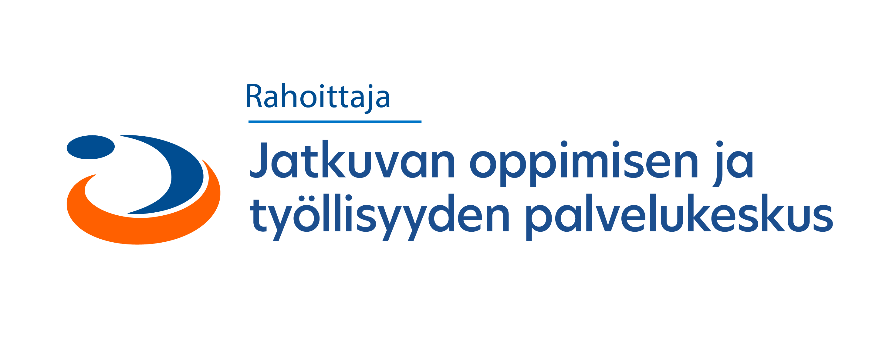

# OpenCV-koulutus

Tämä on Seinäjoen ammattikorkeakoulun toteuttaman ohjelmistosuunnitteluhankkeen aikana luotu oppimismateriaalikokonaisuus OpenCV-konenäkökirjastosta. Hankkeen rahoittajana toimi jatkuvan oppimisen ja työllisyyden palvelukeskus Jotpa.

Aloita matkasi OpenCV:n ihmeelliseen maailmaan tiedostosta [01-johdanto.md](01-johdanto.md).

